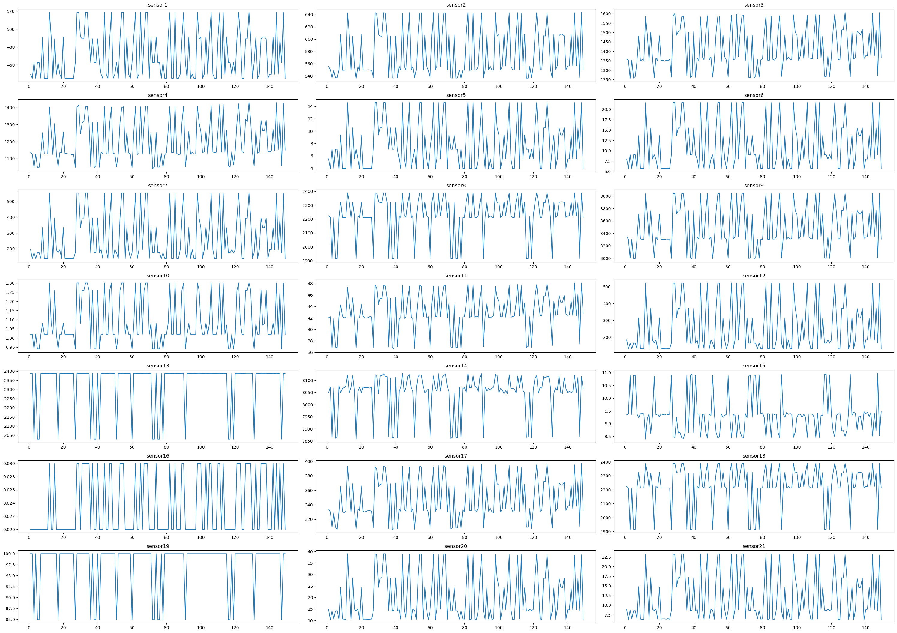
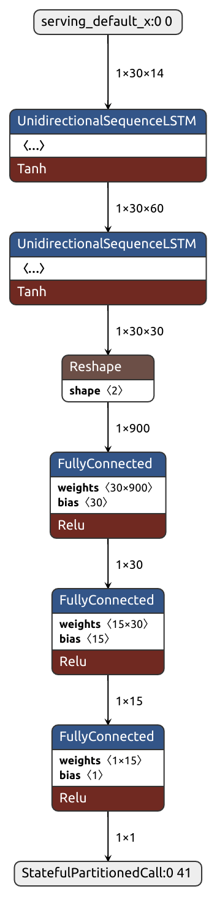

# Inferenza Live per calcolo della RUL (*Remaining Useful Life*) su motori a reazione con *TensorFlowLite Micro e X-CUBE-AI*  

L'obiettivo di questo lavoro è ricreare i modelli di proposti all'interno del paper di cui sopra i quali si propongono di calcolare il valore di **RUL** (*Remaining Useful Life*) per quanto riguarda dei motori a reazione proposti dalla **NASA** all'interno del dataset <a href="https://data.nasa.gov/Aerospace/CMAPSS-Jet-Engine-Simulated-Data/ff5v-kuh6">C-MAPSS Aircraft Engine Simulator Data</a>. 

## Outline

1. [Descrizione del Dataset](#1-descrizione-del-dataset)

2. [Preparazione dei dati](#2-preparazione-dei-dati)
   
   1. [Caricamento dei dati e prima elaborazione](#caricamento-dei-dati-e-prima-elaborazione-1-4)
   
   2. [Considerazioni sui sensori](#considerazioni-sui-sensori-5-15)
   
   3. [Min-Max Scaling](#min-max-scaling-16-24)

3. [Modelli](#modelli)
   
    1. [LSTM Small](#lstm-small)
   
    2. [LSTM Large](#lstm-large)

    3. [CNN Small](#cnn-small)

    4. [CNN Large](#cnn-large)

    5. [CNN Alternativa](#cnn-alternative)
   
    3.[Metriche](#metriche)
   
   1. [S-Score](#s-score)
   
   2. [RMSE](#rmse)
   
   4.[Funzioni di Loss](#funzione-di-loss) 
4. [Risultati Addestramento](#risultati-addestramento-fd001)

5. [Conversione del modello in Tflite](#conversione-modello-in-tflite)
6. [Impronte in memoria post-conversione](#impronte-in-memoria-post-conversione)
7. [Perdita di performance post-conversione](#perdite-di-performance-post-conversione) 
8. [Considerazioni su chip ARM e presentazione dei target](#considerazioni-su-processori-arm-e-presentazione-dei-target)
9. [Deploy dell'applicazione di validazione](#deploy-dellapplicazione-di-validazione-su-nucleo-f446re)
10. [Comunicazione via UART con NUCLEO](#comunicazione-via-uart-con-nucleo)
11. [Comunicazione via UART con Arduino](#comunicazione-uart-con-arduino)
12. [Inferenza live su Arduino](#inferenza-live-su-arduino)
13. [Inferenza live su Nucleo](#inferenza-live-su-nucleo)

## 1. Descrizione del dataset

Data sets consists of multiple multivariate time series. Each data set is further divided into training and test subsets. Each time series is from a different engine i.e., the data can be considered to be from a fleet of engines of the same type. Each engine starts with different degrees of initial wear and manufacturing variation which is unknown to the user. This wear and variation is considered normal, i.e., it is not considered a fault condition. There are three operational settings that have a substantial effect on engine performance. These settings are also included in the data. The data is contaminated with sensor noise.

I data sets consistono di diverse serie temporali multivariate, ogni data set è poi diviso in una parte di *training* e una parte di *test*. Ogni serie temporale proviene da un diverso motore, di conseguenza i dati possono essere considerati come provenienti da una serie di motori della stessa tipologia. Ogni motore comincia con un diverso tipo di degrado iniziale e con alcune differenze a livello di fattura che non sono note all'utente (il degrado iniziale e le variazioni tra un motore e l'altro non sono considerate una condizione di *"fault"*). Ci sono tre *operational settings* le quali hanno un effetto sostanziale sulla performance del motore (queste vengono incluse nei dati). 

All'inizio di ogni serie temporale il motore opera normalmente e sviluppa un problema a un certo punto durante la serie. All'interno del *training set* il problema cresce fino a rendere il sistema inutilizzabile; nel *test set* la serie temporale si conclude prima che il sistema vada in stato di *failure*. 

L'obiettivo è quello di predirre il numero di cicli operazionali rimanenti prima che avvenga un fallimento per quanto riguarda i dati presenti nel test set. Per verificare l'inferenza della rete all'interno della cartella del dataset sono presenti i file *RUL_FD001-4.txt* i quali contengono i valori della RUL per ogni unità operativa (per ogni motore)

Ogni file del dataset è un file di testo composto da 26 colonne di numeri separate da spazi. Ogni riga rappresenta lo snapshot dei dati raccolti durante un singolo ciclo operazionale, ogni colonna è una differente variabile. 

- Data Set: FD001
  Train trjectories: 100
  Test trajectories: 100
  Conditions: ONE (Sea Level)
  Fault Modes: ONE (HPC Degradation)

- Data Set: FD002
  Train trjectories: 260
  Test trajectories: 259
  Conditions: SIX
  Fault Modes: ONE (HPC Degradation)

- Data Set: FD003
  Train trjectories: 100
  Test trajectories: 100
  Conditions: ONE (Sea Level)
  Fault Modes: TWO (HPC Degradation, Fan Degradation)

- Data Set: FD004
  Train trjectories: 248
  Test trajectories: 249
  Conditions: SIX
  Fault Modes: TWO (HPC Degradation, Fan Degradation)

Ci sono 6 condizioni (o combinaizoni di esse) che possono verificarsi: 

- Condition 1: Altitude = 0, Mach Number = 0, TRA = 100
- Condition 2: Altitude = 10, Mach Number = 0.25, TRA = 100
- Condition 3: Altitude = 20, Mach Number = 0.7 TRA = 100
- Condition 4: Altitude = 25, Mach Number = 0.62, TRA = 60
- Condition 5: Altitude = 35 Mach Number = 0.84, TRA = 100
- Condition 6: Altitude = 42, Mach Number = 0.84, TRA = 100

Per quanto riguarda i datasets abbiamo: 

- FD001: **soltanto** condizione 1

- FD002: **Mix** di tutte le condizioni 

- FD003: **soltanto** condizione 1

- FD004: **Mix** di tutte le condizioni

Le colonne corrispondono a

1) unit number
2) time, in cycles
3) operational setting 1
4) operational setting 2
5) operational setting 3
6) sensor measurement 1
7) sensor measurement 2 
   [...]
   '26') sensor measurement 21

## 2. Preparazione dei dati

Il processo di data preparation si svolge come segue: 

1. Vengono raccolte le varie componenti del dataset in data frames
2. Vengono rimossi i sensori "*inutili*"
3. Viene applicata una funzione lineare a tratti ai valori della RUL
4. Vengono formattati per essere dati in input durante la fase di addestramento. 


### Caricamento dei dati e prima elaborazione

Il caricamento dei dati in memoria viene effettuato utilizzando le librerie *Pandas* e *NumPy*, i dati vengono caricati in 4 dataframe i quali corrispondono ai vari FD001-4.txt che si trovano all'interno del dataset. 
Essi vengono tenuti separati per semplicità di confronto con il paper di cui sopra. 

<figure>


<figcaption align='center'><i>Rappresentazione grafica della lista train</i></figcaption>
</figure>

### Considerazioni sui sensori

All'interno della sezione di *Data Preprocessing* del paper in esame viene detto:

> After reviewing all sensors, it is found that some of them
> have constant values, hence we can remove them. Therefore,
> 14 sensors remained for each sub-dataset (sensor 2, 3, 4, 7,
> 8, 9, 11, 12, 12, 13, 14, 15, 17 and 20).

**Tuttavia** come appreso tramite l'analisi dei dati all'interno del training set ciò non è vero per ogni parte componente il dataset. 

È invece vero per quanto riguarda **FD001 e FD003**. La causa è probabilmente da ricercarsi in quanto detto pocanzi per quanto riguarda le condizioni di volo registrate dai sensori, si ricorda infatti che FD001 e FD003 rappresentano voli in condizioni **costanti** mentre FD002 e FD004 ne rappresentano altri in condizioni **miste**. 

Riportiamo i grafici che rappresentano i valori dei sensori rispettivamente in FD001 e FD002:

<figure>

<figcaption align='center'><i>Sensori FD001</i></figcaption>
</figure>

<figure>

<figcaption align = 'center'><i>Sensori FD002</i></figcaption>
</figure>

Gli autori del paper hanno preso la decisione di eliminarli da ogni componente del dataset. La *ratio* che li ha portati a questa decisione non si evince dal documento, tuttavia si potrebbe ipotizzare che i valori di quei sensori siano costanti per ogni condizione e che quindi rappresentino una *"sommatoria di tratti costanti a seconda della condizione di volo"*, ma questa rimane comunque soltanto un'ipotesi. 

Per correttezza nella riproduzione (e per rendere i risultati maggiormente comparabili) abbiamo scelto di rimuovere gli stessi sensori anche noi. 

I sensori rimossi sono: 

- Sensor 1
- Sensor 5 
- Sensor 10 
- Sensor 16
- Sensor 18
- Sensor 19

### Min Max Scaling 

Dato che i sensori sono affetti da rumore si è deciso di applicare del Min Max scaling. Ciò viene effettuato tramite l'oggetto **MinMaxScaler** presente nella libreria *sklearn* il quale si occuperà di effettuare l'operazione su ogni dataframe istanziato all'interno della lista *train*. 
Per sicurezza abbiamo verificato che la distribuzione dei dati non fosse cambiata a seguito di qualche errore nel codice. Riportiamo  di seguito i grafici delle distribuzioni dei dati dei vari sensori prima e dopo lo scaling: 

<figure>

<figcaption align='center'><i>Distribuzione FD001 pre-scaling</i></figcaption>
</figure>

<figure>

<figcaption align='center'><i>Distribuzione FD001 post-scaling</i></figcaption>
</figure>

NB:*Tutti i grafici sono stati realizzati tramite le librerie Seaborn e Matplotlib di Python*

### Funzione lineare a tratti
A questo punto bisogna applicare una funzione lineare a tratti ai valori della RUL. Ovvero abbiamo bisogno  che tutti gli elementi del dataset con valore superiore a 125 (in letteratura questo valore varia tra i 100 e i 125) vengano normalizzati a questo valore come descritto in seguito. 

>Furthermore, the value of the maximum cycle s capped at 100 and remained constant until degradation has
> occur as shown in Fig 2. This allows the deep learning models
> to differentiate between the healthy state (RUL = 100) and
> unhealthy state (RUL < 100). Even though degradation can
> happen randomly, the early stages of engine cycle are assumed
> to be usable and functional. The labels are the RUL cycle for
> each instance of the data.

<figure>

<figcaption align='center'>Maximum RUL of gas turbine engine are capped to
100 cycle to distinguish the healthy state and degradation state
during preprocessing stage.</figcaption>
</figure>

Riferimenti: 

<a href = 'https://ieeexplore.ieee.org/abstract/document/9207051?casa_token=mj5ETeDbMFIAAAAA:ZCf8jWyvO0wN6k7igZNQtXoMJGq5dSqb7YYiaeHxqL7M5L0Y1jkyrk8HzGxoq3_bnmy7tOHI'>Asymmetric loss
functions for deep learning early predictions of remaining useful life in
aerospace gas turbine engines</a>

## Modelli

Gli autori del paper che stiamo cercando di riprodurre propongono come migliori modelli due reti **LSTM** (Long Short Term memory) una di dimensioni ridotte mentre l'altra full size, esse sono rappresentate come segue:

**LSTM SMALL**

| Lyer(Type)     | Output Shape   | Params |
| -------------- | -------------- | ------ |
| LSTM           | (None, 30, 60) | 18240  |
| LSTM           | (None, 30,60)  | 10920  |
| Flatten        | (None,900)     | 0      |
| Dense          | (None,30)      | 465    |
| Dense          | (None, 15)     | 465    |
| Dense (Output) | (None, 1)      | 16     |

- Total params: 56,671
  
  - Trainable params: 56,671
  
  - Non-trainable params: 0

**LSTM LARGE**

| Layer (Type) | Output Shape    | Params |
| ------------ | --------------- | ------ |
| LSTM         | (None, 30,128)  | 73728  |
| Dropout      | (None, 30, 128) | 0      |
| LSTM         | (None, 30, 64)  | 49408  |
| Dropout      | (None, 30, 64)  | 0      |
| LSTM         | (None, 30, 32)  | 12416  |
| Dropout      | (None, 30, 32)  | 0      |
| LSTM         | (None, 30, 16)  | 3136   |
| Dropout      | (None, 30, 16)  | 0      |
| Flatten      | (none 480)      | 0      |
| Dense        | (None, 64)      | 30784  |
| Dense        | (None, 32)      | 2080   |

- Total params: 171,585
  
  - Trainable params: 171,585
  
  - Non-trainable params: 0

Descriveremo in seguito le metriche di valutazione e la funzione di Loss utilizzata per l'addestramento.  

**Iperparametri LSTM Small** 

- Optimizer: Adam 
- Initial learning rate: 0.001 
- Epochs: 50
- Batch size: 256
- Alpha value: 0.2 

**Iperparametri LSTM Large**

- Optimizer: Adam 
- Initial learning rate: 0.01
- Epochs: 100
- Batch Size: 256
- Alpha value: 0.4 

Entrambe le reti sono addestrate con l'utilizzo di alcune funzioni di callback di tensorflow quali: 

- Model Checkpoint: permette di salvare la rete con il valore di *validation loss* più basso tra tutte le epoche di addestramento per ridurre l'overfitting.

- LearningRateScheduler: riduce il learning rate sulla base del numero di epoche. Per le reti ne abbiamo creati due differenti, il primo  ha il seguente codice: 
  
```Python
def scheduler(epoch, lr):
    if epoch < 10:
        return lr
    elif epoch >= 10 and epoch < 20 :
        return 0.001
    elif epoch >= 20 and epoch < 30: 
        return 0.0001
    elif epoch >= 30: 
        return 0.00001
    else: 
        return 0.01;   
```


Ovvero divide per 10 il learning rate ogni 10 eopoche fino a 30

Il secondo invece lo divide per 10 ogni 30 epoche:
~~~ Python
def scheduler2(epoch, lr):
    if epoch < 30:
        return lr
    elif epoch >= 30 and epoch < 60 :
        return 0.001
    elif epoch >= 60 and epoch < 90: 
        return 0.0001
    elif epoch >= 90: 
        return 0.00001
    else: 
        return 0.01; 
~~~

**CNN SMALL**

| Lyer(Type)     | Output Shape   | Params |
| -------------- | -------------- | ------ |
| Conv1D         | (None, 23, 64)  | 7232  |
| Conv1D         | (None, 18, 32)  | 12320 |
| Conv1D         |  (None, 16, 16) |1552   |
| MaxPooling1D   | (None,8,16)     | 0    |
| Flatten          | (None, 128)     | 0    |
| Dense | (None, 32)      | 4128     |
| Dense | (None, 1)   | 33|


**CNN LARGE**

| Lyer(Type)     | Output Shape   | Params |
| -------------- | -------------- | ------ |
| Conv1D         | (None, 23, 64)  | 14464  |
| Conv1D         | (None, 18, 64)  | 49216 |
| Conv1D         | (None, 15, 32)  | 8224 |
| Conv1D         |  (None, 14, 16) |1040   |
| MaxPooling1D   | (None,7,16)     | 0    |
| Flatten          | (None, 112)     | 0    |
| Dense | (None, 32)      | 3616     |
| Dense | (None, 1)   | 33|

**CNN Alternativa**

| Lyer(Type)     | Output Shape   | Params |
| -------------- | -------------- | ------ |
| Conv1D         | (None, 24, 256)  | 25344  |
| Conv1D         | (None, 18, 96)  | 172128  |
| Conv1D         |  (None, 12, 32) | 21536   |
| GlobalAveragePooling1D  | (None,32)     | 0    |
| Dense          | (None, 64)     | 2112    |
| Dense | (None, 128)      | 8320     |
| Dense | (None, 1)        |       129|

**Iperparametri CNN small** 

- Optimizer: Adam 
- Initial learning rate: 0.01
- Epochs: 80
- Batch Size: 256
- Alpha value: 0.2 

**Iperparametri CNN Large**

- Optimizer: Adam 
- Initial learning rate: 0.01
- Epochs: 150
- Batch Size: 256
- Alpha value: 0.2 

**Iperparametri CNN Alternativa (MSE)**
- Optimizer: Adam 
- Initial learning rate: 0.001
- Epochs: 30
- Batch Size: 64

**Iperparametri CNN Alternativa (QUAD-QUAD)**
- Optimizer: Adam 
- Initial learning rate: 0.001
- Epochs: 30
- Batch Size: 64
- Alpha value: 0.2 


### Metriche

#### S-Score:

$$
Score = \begin{cases} \sum^{N}_{n=1} e^{\frac {-d_i} {13}} - 1   , & \text{if} \space \space d_i \lt 0 \\
\sum^{N}_{n=1} e^{\frac {d_i} {10}} - 1, &\text{otherwise} \space \space \end{cases}
$$

<figure>
</img>
<figcaption align= 'center'>Score value as the error increases. The score is
calculated using the scoring function where late predictions receive higher penalisation </figcaption>
</figure>

#### RMSE:

$$
RMSE = \sqrt{\frac{1}{N}\sum^N_{i=1} d_i^2}
$$

### Funzioni di Loss

**QUAD-QUAD**:
> Last cycles of an engine life are more significant than the initial cycles. Thus, a piecewise linear RUL function is applied, where a max RUL value is set if the true RUL is greater than LSTM this max value, as shown in Eq. 2. In this way, we ignore data whose true RULs are greater than the maximum limit to pay attention to the degradation data and we adopt a max RUL value of **125**, as used in [<a href='https://ieeexplore.ieee.org/abstract/document/8998569?casa_token=m6jBHKB0s_4AAAAA:qt23ITJDbDXkIeKp7wxjpRmv3OlJRg3otquWxHHAr1zO_nx1AwkSb5kNiqVw0S5gB_tAFjuv'>19</a>] and other related works.

Una funzione asimmetrica di questo tipo è, quindi, necessaria ai fini di penalizzare le predizioni che vanno oltre la RUL effettiva (*late predictions*).

$$
QUAD - QUAD = \begin{cases} 2a(\hat y_i - y_i )^2 , & \text{if} \space \space d_i \lt 0 \\
    2(a+(1-2a))(\hat y_i - y_i )^2, &\text{otherwise} \space \space \end{cases}
$$

**MSE**:

Abbiamo, inoltre, verificato sperimentalmente l'efficacia del *Mean Square Error* come funzione di loss in fase di addestramento. Quest'ultima, tuttavia, non rispetta ciò che abbiamo descritto in precedenza, ovvero non penalizza le *late predictions*. 

$$ MSE = \frac{1}{n} \sum_{i=1}^{n} (y_i - \hat{y}_i)^2 $$

## Risultati Addestramento FD001

### LSTM SMALL

**LSTM Small QUAD**
|RMSE | S-Score|
|-----|--------|
|14,83| 363,66 |

**LSTM Small MSE**
|RMSE | S-Score| 
|------| ------| 
| 15,0 | 440.03| 

- Risultati stato dell'arte:    
  
  - RMSE: 14,94
  - S-Score: 495

### LSTM LARGE 

**LSTM Large QUAD**
|RMSE | S-Score| 
|------| ------| 
| 14,6 | 367.13|

**LSTM large MSE**
|RMSE | S-Score| 
|------| ------| 
| 14,0 | 350,79| 

- Risultati stato dell'arte:    
  
  - RMSE: 14,5
  - S-Score: 347,78

I risultati mostrano come le due reti con prestazioni migliori siano quelle sviluppate in questa sede. 

### CNN SMALL

**CNN Small**
|RMSE | S-Score| 
|------| ------| 
| 18,87 | 566,55|


**Risultati Stato dell'Arte** :
  - CNN SMALL
    - RMSE: 15,08 
    - S-Score: 472, 75 

### CNN LARGE
**CNN Large**
|RMSE | S-Score| 
|------| ------| 
| 18,23 | 548,84|

**Risultati stato dell'Arte**
  - CNN LARGE: 
    - RMSE: 13,84
    - S-Score: 422,41


### CNN ALTERNATIVE

**CNN Alternative MSE**
|RMSE | S-Score| 
|------| ------| 
| 15,8 | 472.48| 

**CNN Alternative QUAD**
|RMSE | S-Score| 
|------| ------| 
| 15,9 | 434   | 

Per quanto riguarda il campo delle CNN non siamo riusciti a riprodurre i risultati proposti. Tuttavia, cambiando la topologia della rete e i relativi iperparametri, siamo riusciti ad ottenerne di simili con le CNN alternative. Ancora una volta, anche in questo caso, l'addestramento tramite la funzione QUAD-QUAD risulta più efficace.

## Risultati addestramento FD002
**LSTM Small**
|RMSE | S-Score| 
|------| ------| 
|28.4 | 17416.99   | 

**LSTM Large** 
|RMSE | S-Score| 
|------| ------| 
|31.59 | 45826.58   | 
**CNN Small** 
|RMSE | S-Score| 
|------| ------| 
|33.03 |22775.01   | 
**CNN Large** 
|RMSE | S-Score| 
|------| ------| 
|31.86 | 25606.40  | 

## Risultati addestramento FD003

**LSTM small**
|RMSE | S-Score| 
|------| ------| 
|14.71 | 284.55  | 

**LSTM large**
|RMSE | S-Score| 
|------| ------| 
|13.78 | 289.78  | 

**CNN Small** 
|RMSE | S-Score| 
|------| ------| 
|17.53 | 547.38  | 

**CNN Large**
|RMSE | S-Score| 
|------| ------| 
|20.63 | 1036.23| 

**CNN Alternativa (QUAD-QUAD)**
|RMSE | S-Score| 
|------| ------| 
| 14.99 | 278.12|

## Risultati addestramento FD004

**LSTM Small**
|RMSE | S-Score| 
|------| ------| 
|28.68 | 13479.67   | 

**LSTM Large** 
|RMSE | S-Score| 
|------| ------| 
|31.28 |54363.35   | 
**CNN Small** 
|RMSE | S-Score| 
|------| ------| 
|35.08|19328.83   | 
**CNN Large** 
|RMSE | S-Score| 
|------| ------| 
| 34.65 |  22526.32  | 


*NB: per le versioni FD002 e FD004 delle LSTM sono state effettuate delle modifiche rispetto ai modelli di riferimento.**

Nonostante i risultati ottenuti su queste due parti del dataset siano in linea con la stragrande maggioranza dello stato dell'arte non risultano comunque pienamente soddisfacenti. Nella configurazione originale le performance delle reti risultavano ancora più povere. Per l'ottimizzazione si è utilizzata una istanza di Keras Tuner prima con ricerca di tipo Random Search e poi con ottimizzazione bayesiana. 

È possibile che le reti non siano abbastanza grandi da poter riuscire a rappresentare con precisione dati di questo tipo. C'è,inoltre, una chiara tendenza all'overfitting, motivo per cui è stato ridotto di molto il numero delle epoche di addestramento per queste due particolari parti del dataset. 


## Conversione modello in tflite

Per poter effettuare il deploy su microcontrollore dobbiamo innanzitutto convertire il modello in formato *.tflite* 

~~~ Python
from tflite_converter import convert_to_tflite
MODEL_DIR = './models/FD001/LSTMsmall/QUAD-QUAD/'
BATCH_SIZE = 1
STEPS = 30 
INPUT_SIZE = 14
nome = "lstm_small_batch_1.tflite"
convert_to_tflite(MODEL_DIR, BATCH_SIZE, STEPS, INPUT_SIZE, lstm_small_quad, nome)
~~~
La conversione in tflite converte il modello sviluppato su desktop in un modello più leggero che può essere sfruttato su macchine a risorse limitate. In particolare il convertitore attua delle ottimizzazioni di vario tipo per migliorare l'efficienza del modello, specialmente sotto il punto di vista della memoria. 

Alcuni esempi di ciò sono la quantizzazione dei pesi e delle attivazioni, la riduzione del numero di parametri attraverso il pruning, la fusione di alcune operazioni per l'ottimizzazione su hardware specifico e l'ottimizzazione del layout dei tensori. 

Alcune di queste potrebbero essere gestite in maniera fine dall'utente, se necessario.

Come è possibile vedere dal codice sopra le dimensioni del *batch* vengono, in questo passaggio diminuite da 256 a 1, ciò avviene poiché X-CUBE-AI non è in grado di processare reti neurali per cui questo valore sia superiore a 1. Per di più una simile dimensione dei dati di input sarebbe un grave problema per un MCU come quello in nostro possesso dato che ognuno dei dati è un numero floating point e per ogni elemento del batch ne devono essere memorizzati 420 (30*14, ovvero dimensione della finestra per numero di feature in input).

A questo punto abbiamo il nostro modello in formato *.tflite*, il quale si presenta come segue: 
<figure align = 'center'>

<figcaption align='center'>Notare come la dimensione dell'input è passata da 256x30x14 a 1x30x14</figcaption>
</figure>

## Impronte in memoria Post-Conversione 

|LSTM Small | LSTM Large | CNN small | CNN Large | CNN Alternative|
|-----------|------------|-----------|-----------|----------------|
| **RAM:** 14,59  **FLASH:** 240 KB | **RAM:** 28,68 KB **FLASH**:691 KB | **RAM**: 11,30KB **FLASH**:112,29 KB| **RAM**: 19,84 KB **FLASH**:313,40 | **RAM:** 34,47 KB **FLASH**: 910 KB| 


È facilmente constatabile come la rete più pesante sia la CNN alternativa e, in particolare, di dimensione sostenibile soltanto da uno dei due target in esame. Al momento, quindi, la rete con la migliore *performance per byte* è la **LSTM Small**


## Perdite di performance post-conversione

**LSTM Small TFLITE**
|MSE | QUAD - QUAD | 
|---------|--------| 
|**RMSE:** 21,35         |    **RMSE:** 19,36|
|**S-Score:** 1488.53    | **S-Score:** 876,9|


**LSTM Large TFlite**
|MSE | QUAD - QUAD | 
|--------|---------|
|**RMSE:** 19,8| **RMSE:** 29,9| 
|**S-Score:** 1271,42  | **S-Score:** 31914,148|

*Nota: Probabilmente per quanto riguarda la large QUAD-QUAD si tratta di un caso particolarmente sfortunato dovuto ai procedimenti stocastici in fase di addestramento*

**CNN Small e Large TFlite**
| CNN Small | CNN Large |
|-----------|-----------|
|**RMSE**:18,87  | **RMSE**: 18,23  | 
|**S-Score**:566.55| **S-Score**: 548,84|

**CNN Alternative**

|MSE | QUAD-QUAD| 
|-----|---------|
|**RMSE**:15,8  | **RMSE**: 15,93  | 
|**S-Score**:472,48| **S-Score**: 434,02|


Come è possibile constatare, le reti di tipo LSTM subiscono gravi perdite di performance a seguito della conversione in *tflite*. Al contrario le reti di tipo CNN, nonostante non riescano ad eguagliare le performance delle LSTM "*non convertite*", subiscono in maniera molto minore il calo di performance legato alla conversione. 
Per quanto riguarda il deploy su microcontrollore, quindi saremmo tentati di scegliere proprio quest'ultima architettura, tuttavia il panorama delle opzioni si amplia se teniamo in considerazione le potenzialità di X-CUBE-AI. 

Mi spiego meglio, il workflow per il deploy su microcontrollore di una applicazione TensorFlow Lite Micro è abbastanza standard: 
1. Compilare e addestrare la rete tramite Keras e TensorFlow in Python 
2. Convertire la rete in formato *.tflite* 
3. Ricavare il file binario della rete tramite il comando: 
~~~ bash 
!xxd -i network.tflite > model_data.cc
~~~
4. Effettuare il deploy su microcontrollore come spiegato nei paragrafi precedenti. 

Tuttavia, se parliamo di X-CUBE-AI non siamo limitati esclusivamente a questo tipo di modelli. Su microcontrollori che supportano questa tecnologia siamo in grado di utilizzare anche reti con formato *.h5*, ovvero il formato nativo di TensorFlow e Keras per desktop. Di conseguenza con una rete di dimensioni abbastanza ridotte potremmo essere in grado di sfruttarne la piena potenzialità. Ed è proprio questo che abbiamo fatto, effettuando il deploy della rete con performance migliori secondo l'S-Score, ovvero la LSTM small addestrata con funzione QUAD-QUAD di cui riportiamo le performance prima della conversione e dopo la conversione in tflite: 

pre-conversione: 
|RMSE | S-Score|
|-----|--------|        
|14,83| 363,66 |


post-conversione: 
|MSE | QUAD - QUAD | 
|---------|--------| 
|**RMSE:** 21,35         |    **RMSE:** 19,36|
|**S-Score:** 1488.53    | **S-Score:** 876,9|

Per una impronta in memoria che non varia di molto: 
|Formato Keras | Formato TFLite|
|--------------|---------------|
|**RAM**:14,59 KB | **RAM**: 14,59 KB  | 
| **FLASH:** 240,86 KB| **FLASH**:240 KB | 


## Considerazioni su processori ARM e presentazione dei target
I due principali chip all'interno del panorama TinyML sono 
- Cortex-A (Raspberry Pi 4 B)
- Cortex-M (STM32F446RE e Arduino Nano 33 BLE)

Il primo risulta essere quello maggiormente potente e, tuttavia, meno efficiente dal punto di vista energetico, viceversa per il secondo. 

Per quanto riguarda la parte più strettamente *"embedded"* del nostro progetto abbiamo utilizzato i seguenti target: 

Cortex-M4: 
- STM32 NUCLEO-F446RE: 

  - Cortex-M4F da 180 MHz
  - 512 kB di memoria flash
  - 128 kB di memoria SRAM
- Arduino Nano 33 BLE: 

  - Cortex-M4F da 64 MHz
  - 1 MB di memoria flash
  - 512 kB di memoria SRAM

Cortex-A72: 

  - Raspberry Pi 4 Model B: 
    - Cortex-A72 64-bit 1.8 GHz
    - 2 GB RAM LPDDR4 
    - 32 GB memoria SD

La raspberry come è possibile notare sia molto più potente delle concorrenti e possiede moolte più risorse. Nel corso del nostro progetto avrà la funzione di fornire i dati ai microcontrollori e, tramite un confronto, a far capire quanto incida sul tempo di inferenza l'*overhead* causato dall'interprete python.  

In particolare per il deploy sulla raspberry utilizzeremo comunque python come linguaggio di programmazione, tuttavia per effettuare l'inferenza non avremo bisogno dell'intera libreria di tensorflow ma soltanto l'interprete di Tensorflow Lite Micro, che può essere facilmente installato con 

```bash
pip3 install --extra-index-url https://google-coral.github.io/py-repo tflite_runtime
```

ed importato tramite le seguenti righe di codice: 

```Python
import tflite_runtime
from tflite_runtime.interpreter import Interpreter 
```

Ovvivamente grazie alla presenza di python e del sistema operativo sottostante basato su *Debian* effettuare il deploy in questo contesto risulta particolarmente semplice. Tuttavia ciò ha il prezzo di essere la maniera meno efficiente (e meno sicura dal punto di vista dei crash su lungo periodo). 

Tempi di inferenza medi (*tempi per la rete LSTM small con batch size 1*): 

- Desktop: 333.83 $\mu s $ (Notebook Python)
- Destkop: 285.69 $\mu s $(File Py)  
- RaspberryPi: 800.51 $\mu s $ (File Py)

Per calcolare il tempo di inferenza medio abbiamo utilizzato il seguente codice:  

```Python
import time 
from tflite_runtime.interpreter import Interpreter 
import numpy as np

def inference_time_calculator(interpreter, input_full, input_details): 
    inference_records = []
    inference_sum = 0
    for i in range(10, 20): 
        input_data = input_full[i-1: i, :30, :14]
        interpreter.set_tensor(input_details[0]['index'], input_data)

        #calcolare il tempo di inferenza

        start_time = time.time()
        interpreter.invoke()
        end_time = time.time() 

        inference_time = (end_time - start_time)*1e6

        inference_records.append(inference_time)

    for inference_time in inference_records: 
        inference_sum += inference_time

    return inference_sum / len(inference_records)
```
## X-CUBE-AI e Tensorflow Lite Micro

Le due principali librerie che utilizzeremo per questo progetto sono X-CUBE-AI (progetto closed source di STM) e Tensorflow Lite Micro (progetto open source di google). 

X-CUBE-AI è un Pacchetto di Espansione STM32Cube, che fa parte dell'ecosistema STM32Cube.AI. Estende le capacità di STM32CubeMX con la conversione automatica di algoritmi di intelligenza artificiale preaddestrati, inclusi modelli di reti neurali e modelli di apprendimento automatico classici. Integra anche una libreria ottimizzata generata nel progetto dell'utente. E, ovviamente, supporta esclusivamente microcontrollori prodotti da STM. 

TensorFlow Lite micro è progettato per eseguire modelli di machine learning su microcontrollori e altri dispositivi con risorse limitate. Il core runtime si adatta a soli 16 KB su un Arm Cortex M3 e può eseguire molti modelli di base. Non richiede il supporto del sistema operativo, alcuna libreria C o C++ standard o l'allocazione dinamica della memoria. Anzi, in questo specifico panorama applicativo è preferibile che l'allocazione della memoria sia statica per evitare frammentazione sul lungo periodo. 

## Deploy dell'applicazione di Validazione su NUCLEO-F446RE
1. Collegare NUCLEO al PC tramite un cavo USB-B -> USB-A

2. Installare e aprire **STM32CubeMX** 
   
   - La procedura può essere portata a termine anche utilizzando soltanto STM32CubeIDE ma, nel momento in cui scrivo c'è un bug al momento della generazione del codice che non permette alla procedura di andare a buon fine

3. Installare il pacchetto X-CUBE-AI dal gestore dei pacchetti situato nella sezione *help* del menu a tendina 

4. Selezionare la board desiderata, nel nostro caso *NUCLEO-F446RE*, selezionare la scheda con un doppio click 
   
   <figure>
   </img>
   <figcaption align='center'></figcaption>
   </figure>

5. Verrà aperto un file *.ioc* da cui programmare il microcontrollore, dovremmo trovarci davanti una schermata come questa 
   
   <figure>
   </img>
   <figcaption align='center'></figcaption>
   </figure>

6. Andiamo innanzitutto a configurare il pacchetto aggiuntivo che abbiamo installato
   
   - Guardando nel menù di sinistra selezioniamo la voce *Middleware and Software Packs*
   - Selezioniamo X-CUBE-AI 
   - Scegliamo la versione della libreria e specifichiamo il tipo di applicazione (nel nostro caso validation)

<figure>
</img>
<figcaption align='center'></figcaption>
</figure>

7. Selezioniamo nuovamente X-CUBE-AI dal menu a sinistra e carichiamo la nostra rete neurale
   - Si possono in questa fase effettuare anche la *validazione su desktop* e l'analisi della rete che ci permetterà di comprendere se è necessario un qualche tipo di intervento prima del deploy 
   - Spesso alcune reti neurali potrebbero essere troppo grandi a livello di flash oppure occupare troppa memoria ram, in questi casi è possibile ricorrere alla compressione direttamente da CubeMX oppure tornare in fase di progettazione della rete per applicare delle ottimizzazioni prima della conversione in formato tflite.

<figure>
</img>
<figcaption align='center'></figcaption>
</figure>

8. A questo punto nel tab Project Manager possiamo dare un nome al progetto e settare i seguenti: 
    - Toolchain/IDE: Nel nostro caso STM32CubeIDE
    - Posizione di salvataggio del codice che verrà generato da CubeMX 

9. A questo punto basta cliccare su Generate Code in alto a sinistra e aprirlo all'interno dell'IDE. 
10. Effettuare il Build del codice ed eseguirlo, in questo modo verrà fatto il flash sulla scheda. 
11. Per verificare che tutto sia andato a buon fine bisogna munirsi di un terminale seriale in grado di mostrarci l'output proveniente dalla board. (Nel nostro caso Putty)
12. Settare i valori come in figura
    - La porta COM può variare a seconda della configurazione in uso, per esserne certi controllare il menu di gestione dispositivi di windows.
    - Nel caso il sistema in uso sia linux è possibile controllare tramite la cartella /dev, dovrebbe trovarsi sotto /dev/ttyACMx

<figure>
</img>
<figcaption align='center'></figcaption>
</figure>

13. Una volta effettuato il collegamento premere il pulsante nero sulla board per il reset. A questo punto si dovrebbe avere una schermata come la seguente: 

<figure>
</img>
<figcaption align='center'></figcaption>
</figure>

14. A questo punto bisogna tornare al file *.ioc* e dal menu di X-CUBE-AI possiamo finalmente effettuare la validazione su target, tenendo sempre a mente di selezionare la porta COM giusta. 

<figure>
</img>
<figcaption align='center'></figcaption>
</figure>

Aggiornando la lista dei tempi sulla base della validazione abbiamo quindi: 

Tempi di inferenza medi (*tempi per la rete con batch size 1*): 

- Desktop: 333.83 $\mu s $ (Notebook Python)
- Destkop: 285.69 $\mu s $(File .py)  
- RaspberryPi: 800.51 $\mu s $ (File .py)
- **NUCLEO-F446RE (72 Mhz): 148.74 $\mu s$ (X-CUBE-AI)** 
***ATTENZIONE QUESTA VOCE È DA AGGIORNARE CON IL CLOCK SETTATO A 180 MHz***

## Comunicazione via UART con NUCLEO
L'idea è quella di utilizzare la raspberry Pi per fornire dinamicamente i dati in ingresso al MCU che li elaborerà e procederà all'inferenza *online*. 
Il primo passo è ovviamente quello di riuscire a comunicare anche semplici stringhe di testo. 

1. Abbiamo configurato i pini PA2 e PA3 come rispettivamente Trasmissione e Ricezione (*TX e RX*) per la connettività USART. 
   
   <figure>
   </img>
   <figcaption align='center'></figcaption>
   </figure>

2. Abbiamo definito due buffer, uno per la lettura e un altro per la memorizzazione effettiva.

```C
uint8_t  rx_buffer[10]; //La dimensione dei buffer è puramente indicativa. 
uint8_t main_buffer[20]; 
```

3. Abbiamo aggiunto al codice la ridefinizione della funzione *HAL_UARTEx_RxEventCallback* che ci permette di definire ciò che avviene una volta completata la lettura.  

```C
void HAL_UARTEx_RxEventCallback(UART_HandleTypeDef *huart, uint16_t Size)
  {
     if(huart -> Instance == USART2){
         memcpy(main_buffer, rx_buffer, Size); // Andiamo a copiare ciò che è contenuto all'interno del buffer di lettura all'interno di quello principale
         HAL_UARTEx_ReceiveToIdle_DMA(&huart2, rx_buffer, 10);
         __HAL_DMA_DISABLE_IT(&hdma_usart2_rx, DMA_IT_HT); //Disabilitiamo l'interrupt di metà trasferimento che altrimenti potrebbe risultare problematico.

     }
  }
```

4. Esternamente al while loop andiamo a inserire queste due righe di codice in cui la prima richiama la funzione per la lettura da UART, mentre la seconda va a disabilitare l'interrupt di metà trasferimento. 
   
   ```C
   HAL_UARTEx_ReceiveToIdle_DMA(&huart2, rx_buffer, 10);
   __HAL_DMA_DISABLE_IT(&hdma_usart2_rx, DMA_IT_HT);
   ```

Ricordiamo infine che per far funzionare la funzione *HAL_UARTEx_RecieveToIdle_DMA* bisogna innanzitutto andare ad aggiungere una DMA request dalle impostazioni della USART che si vuole configurare direttamente dal file *.ioc*. Ciò può essere fatto andando nel menu di sinistra all'interno del file *.ioc*, selezionando la USART che si vuole configurare, e aggiungendo una DMA request all'interno della TAB **DMA Settings**.

Come esempio abbiamo implementato quanto segue tramite la libreria *serial* di python (su Raspberry Pi)
- La raspberry invia il proprio nome alla nucleo
- La nucleo, una volta ricevuto il messaggio lo rimanda indietro all'infinito (o fino a che non si preme reset)
- La raspberry mostra a schermo ciò che ha ricevuto dalla nucleo

In particolare: 

- Raspberry
~~~Python
  import serial
  import time
  

ser = serial.Serial(port = '/dev/ttyACM0', baudrate=115200, timeout = 1) 
time.sleep(1)
ser.reset_input_buffer()
print("Serial OK" )

stringa = "Raspberry"
ser.write(stringa.encode('UTF-8'))
try: 
    while True: 
        time.sleep(0.01) #Per una questione di risorse
        if ser.in_waiting > 0: 
            line = ser.readline().decode('UTF-8').rstrip()
            print(line)
except KeyboardInterrupt: 
    print("Closing Serial Comm")
    ser.close()
~~~


- Nucleo (il seguente codice si trova all'interno del while loop)
~~~ C
for(int i = 0; i < 20; i++){
          if((main_buffer[i] == '\0' && i != 0) || main_buffer[i] == '\n'){
              main_buffer[i] = '\n';
              break;
          }
      }
      if(main_buffer[0] != '\0'){
          HAL_UART_Transmit(&huart2, main_buffer, 20, 100);
          HAL_GPIO_TogglePin(GPIOA, GPIO_PIN_5);
      }
      HAL_Delay(250);
~~~

Una volta compreso come inviare dati attraverso una connessione UART, abbiamo cercato di capire come fare a inviare i dati correttamente dalla raspberry alla Nucleo / Arduino. 

Abbiamo pensato a due approcci differenti: 

1. Inviare ogni "cella" del dataset singolarmente
2. Inviare una intera riga del dataset

Questi approcci hanno entrambi dei pro e dei contro. 
Nel primo caso l'evidente svantaggio è quello di dovere inviare 30*14 volte dati attraverso la connessione, oltre che a dover gestire in maniera molto più rigida la sincronizzazione tra il dispositivo di invio e di ricezione. 
Tuttavia, in questo modo, siamo in grado di non dover spostare su MCU la complessità che deriva dal dover tokenizzare una stringa di valori concatenati. Ovvero, essendo che la connessione UART ci permette di inviare stringhe, dovremmo, per una singola riga, concatenare i valori che la compongono ad esempio in questo modo: *"1234,123; 456,23;..;"* e, solo a questo punto, andare a prelevare i valori dalla stringa direttamente da MCU. Questo allunga molto la dimensione del codice sul target e può portare ad uno spreco di memoria. 

Il secondo caso è invece esattamente l'opposto, utilizziamo meno la connessione UART (solo 30 volte), ma dobbiamo fare i conti su una complessità computazionale che sta più verso il target che verso il device che i dati li invia. 

Ovviamente in un contesto applicativo reale dovremmo affrontare problemi ben diversi data la possibilità di leggenre direttamente dai sensori. 

## Comunicazione UART con Arduino

Espongo brevemente:

**receive_data.ino**:
Dopo aver importato le librerie necessarie dichiariamo un array di 14 elementi che servirà a contenere i dati di una riga del dataset di test.

All'interno del loop utilizziamo la funzione *get_data* della libreria *serial_utils* che ha il compito di recuperare i dati.

Il ciclo *for* finale serve soltanto in fase di debugging per controllare la presenza dei valori corretti all'interno dell'array attraverso il display LCD piuttosto che tramite l'utilizzo della seriale. 

```C++
#include <Wire.h>
#include <LiquidCrystal_I2C.h>
#include "serial_utils.h"

LiquidCrystal_I2C lcd(0x3f, 16,2); 
double entry_list[14];


void setup() {
  // put your setup code here, to run once:
  lcd.begin(); 
  lcd.backlight(); 
  lcd.clear(); 

  //Serial.begin(115200);
  lcd.print("Ready for Data");

}

void loop() {


  get_data(entry_list, 14);


  for(uint8_t i = 0; i < 14 ; i++){
    lcd.clear(); 
    lcd.print(String(entry_list[i])+" "+i);
    delay(2000);
  }


}
```

**serial_utils.cpp**

La funzione prende in input un puntatore chiamato entry_list (che poi sarà il nostro array di 14 elementi) e la sua dimensione.

All'interno di un ciclo infinito controlliamo se sono disponibili dati dalla seriale e, nel caso in cui lo siano, li memorizziamo all'interno di una stringa chiamata new_message. 

A questo punto eliminiamo tutti i dati dalla porta seriale per non triggerare automaticamente l'if al ciclo successivo. 

Controlliamo che il contatore sia sempre minore di size e andiamo a inserire i dati (convertiti da stringa in float ) all'interno dell'array ed incrementare il contatore. 

Una volta che counter ha raggiunto *size* possiamo chiudere il ciclo. 

```C++
void get_data(double* entry_list, uint8_t size) {
  Serial.begin(115200);
  uint8_t counter = 0;

  while (true) {
    if (Serial.available() > 0) {
      String new_message = Serial.readStringUntil('\n');

      //SERIAL FLUSH
      while (Serial.available() > 0) {
        char t = Serial.read();
      }

      if (counter < size) {
        entry_list[counter] = new_message.toDouble();
        Serial.println("OK\n");
        //Serial.println(entry_list[counter], 17);
        counter++;  
      }

      if (counter == size) {
        break;  // Esci dal loop quando hai riempito l'array
      }
    }
  }
}
```

Una volta fatto questo dobbiamo estendere il ragionamento per riempire un array che rispetti le dimensioni dell'input per la nostra rete. 

Dal punto di vista di chi invia invece abbiamo un codice molto simile agli esempi precedenti che può essere reperito all'interno di *'TargetCode/DataTransfer/Rasp/serial_mono_send.py'* 

In ultimo abbiamo esteso il caso della "riga" all'intero frame che poi rappresenterà l'input per la rete.
In questo caso, lato arduino ci siamo semplicemente limitati ad arricchire il file **serial_utils.cpp** e a modificare leggermente il file principale. 
Mentre all'interno del nuovo file python per la raspberry abbiamo semplicemente aggiunto un ciclo for esterno che scorre le righe del frame di 30 elementi da inviare. I files sono in *TargetCode/FullFrame DataTransfer*

In questo modo siamo in grado di fornire al microcontrollore un input completo per l'inferenza da parte della rete. A questo punto dobbiamo automatizzare il processo di invio di nuovi frames da parte della raspberry e caricare la rete neurale all'interno del microcontrollore per effettuare l'inferenza online. 
In questo caso tuttavia a causa della nostra scelta progettuale l'invio dei dati necessari dura molto più che qualche secondo e potrebbe essere necessario tornare sui nostri passi per spostare la complessità nuovamente sulla MCU. 


## Inferenza Live su Arduino

##### Headers
Includiamo innanzitutto tutte le librerie necessarie per il funzionamento dell'applicazione. 
Le prime due (Wire e LiquidCrystal) sono adibite al funzionamento del display LCD, seguono poi degli import standard di TensorFlow Lite Micro. 

Da tenere presente la differenza tra *all_ops_resolver* e *micro_mutable_ops_resolver*. Gli ops resolver sono necessari al fine di caricare tutte le tipologie di layers necessarie per il funzionamento della rete neurale, nel nostro caso, (LSTM Small) abbiamo bisogno soltanto di 3 tipologie di layers: 
- Unidirectional Sequence LSTM
- Reshape
- Fully Connected

Utilizzando *all_ops_resolver* avremmo incluso tutti i possibili layer consumando inutilmente memoria sul microcontrollore. 


~~~ C++
//Includes LCD
#include <Wire.h>
#include <LiquidCrystal_I2C.h> 

//Includes TensorflowLite Micro Standard
#include <TensorFlowLite.h>
//#include "tensorflow/lite/micro/all_ops_resolver.h"
#include "tensorflow/lite/micro/micro_mutable_op_resolver.h"
#include "tensorflow/lite/micro/micro_interpreter.h"
#include "tensorflow/lite/micro/micro_log.h"
#include "tensorflow/lite/micro/system_setup.h"
#include "tensorflow/lite/schema/schema_generated.h"

//Include personali
#include "model_data.h"
~~~

##### Populate input vector
All'interno di questa funzione, come da titolo, andiamo a popolare il vettore di input per la rete neurale con quello che sono i dati forniti dalla Raspberry Pi via UART. 
Contrariamente a quanto accade in python, nonostante l'input shape del primo layer sia (1,30,14) non bisogna istanziare array multidimensionali ma basta inserire tutti i dati di input in sequenza in un array monodimensionale.
Quello che conta è quindi il numero totale di dati, ovvero 30 (dimensione della finestra) e 14 (numero delle features). 


~~~C++
void populateInputVector(TfLiteTensor* input, int size) {
  Serial.begin(115200); 
  int counter = 0; 
  MicroPrintf("Popoliamo il vettore di input");
  while (true){
    //input->data.f[i] = input_data[i];
    if(Serial.available() > 0){
      String new_message = Serial.readStringUntil('\n');
      //SERIAL FLUSH
      while(Serial.available() > 0){
        char t = Serial.read(); 
      }

      if (counter < size){
        input->data.f[counter] = new_message.toFloat();
        Serial.println("OK\n"); 
        counter++; 
      }
      if(counter == size){
        break; 
      }

    }
  }
}
~~~

##### Dichiarazione variabili TFLite Micro e setup()

In questa sezione del codice abbiamo dichiarato tutte le variabili necessarie. Procediamo ad un breve excursus: 
- model: sarebbe un puntatore al modello da caricare in memoria
- interpreter: la struttura dati preposta per l'effettiva inferenza
- input e output
- tensor_arena: la dimensione occupata dai tensori per la rete in memoria, non esiste un modo preciso per determinare questo dato se non seguire i messaggi di errore che verranno forniti direttamente sul terminale seriale dopo che il codice verrà *flashato* sulla board. Questo è uno dei punti più deboli di questo approccio, che tuttavia, specialmente per il numero di file coinvolti, risulta meno dispersivo.

La tensor arena è necessaria per evitare l'allocazione dinamica della memoria su MCU che, dopo grandi periodi di attività, potrebbe portare a frammentazione della stessa.  


All'interno della funzione di setup troviamo innanzitutto l'inizializzazione del display LCD, la funzione di inizializzazione del target (standard di TensorFlow Lite Micro) e il caricamento del modello in memoria. 

Segue poi la dichiarazione degli *Op Resolver*, l'istanziazione dell'interprete, l'allocazione dei tensori e l'assegnazione dei vettori di input e output. 

~~~ C++
namespace {
const tflite::Model* model = nullptr;
tflite::MicroInterpreter* interpreter = nullptr;
TfLiteTensor* input = nullptr; //Input size 420
TfLiteTensor* output = nullptr;


constexpr int kTensorArenaSize = 16384;
// Keep aligned to 16 bytes for CMSIS
alignas(16) uint8_t tensor_arena[kTensorArenaSize];
}  // namespace


void setup() {
  lcd.begin(); 
  lcd.backlight();
  lcd.clear(); 
  lcd.print("Ready"); 
  // put your setup code here, to run once:
  tflite::InitializeTarget();
  model = tflite::GetModel(small_lstm_batch_1_quad_tflite);  
  //static tflite::AllOpsResolver resolver;

  static tflite::MicroMutableOpResolver<3> resolver;
  resolver.AddUnidirectionalSequenceLSTM(); 
  resolver.AddReshape();
  resolver.AddFullyConnected();

  static tflite::MicroInterpreter static_interpreter(
      model, resolver, tensor_arena, kTensorArenaSize);
  interpreter = &static_interpreter;
  TfLiteStatus allocate_status = interpreter->AllocateTensors();
  if (allocate_status != kTfLiteOk) {
    MicroPrintf("AllocateTensors() failed");
    return;
  }
  input = interpreter->input(0);
  output = interpreter->output(0);

}

~~~

##### Inferenza e loop()
All'interno el loop si avvia innanzitutto la funzione per popolare il vettore di input, conclusa questa si può effettuare l'inferenza tramite il comando *interpreter->Invoke()*. 
Nel caso l'inferenza non possa essere eseguita o non vada a buon fine verrà stampata una stringa su terminale seriale. 
Nel caso in cui, invece, l'inferenza vada a buon fine si procede a mostrare l'output sul display LCD. 

~~~ C++
void loop() {
  populateInputVector(input, 420);
  if (kTfLiteOk != interpreter->Invoke()) {
    MicroPrintf("Invoke failed.");
  }
  float RUL = output->data.f[0];

  lcd.clear(); 
  lcd.print("RUL: "+ String(RUL)); 

}
~~~


## Inferenza Live su NUCLEO

procediamo presentando il codice che può essere trovato all'interno della directory *TargetCode/XCUBEAI/NUCLEO_F446RE/XCubeAI_LCD_5th*

Per quanto riguarda il *"motore"* che fa girare la rete si tratta di X-CUBE-AI. Software proprietario di STM32 che genera in automatico le librerie necessarie a far funzionare la rete correttamente. 
Presentiamo di seguito il codice che si trova all'interno di *main.c*, che sostanzialmente è ciò che viene eseguito e nonè automaticamente generato da STM32CUBE IDE. 

##### Headers

In questa sezione troviamo tutti gli import necessari al funzionamento dell'applicazione. 

Gli include della AI possono variare a seconda di che nome viene inserito in fase di configurazione del file *.ioc*, nel nostro caso abbiamo scelto **network**.
Gli altri include sono relativi alla libreria liquidcrystal (che serve per utilizzare il display LCD) e le librerie standard per la gestione e la conversione dei dati.  

```C
/* USER CODE END Header */
/* Includes ------------------------------------------------------------------*/
#include "main.h"

/* Private includes ----------------------------------------------------------*/
/* USER CODE BEGIN Includes */
#include "string.h"
#include "stdio.h"
#include <stdlib.h>
//AI INCLUDES
#include "ai_platform.h"
#include "network.h"
#include "network_data.h"

//LCD DEBUG
#include "liquidcrystal_i2c.h"
/* USER CODE END Includes */

/* Private typedef -----------------------------------------------------------*/
/* USER CODE BEGIN PTD */
```

##### USART Callbacks

In questa sezione troviamo le variabili necessarie alla comunicazione UART, alla rete neurale e, soprattutto, le funzioni di callback che ci permettono di gestire l'ingresso dei dati e il popolamento del vettore di input. 

Istanziamo inoltre i prototipi per le funzioni di INIT e RUN che definiremo in seguito. (Questa parte del codice può essere personalizzata ma dovrebbe essera abbastanza standard). 

Per la comunicazione utilizziamo la funzione *HAL_UARTEx_ReceiveToIdle_DMA()* per la ricezione dei dati e la funzione *HAL_UART_Transmit_DMA()*. 
All'interno della prima funzione di callback utilizziamo un counter per tenere traccia della posizione dell'elemento all'interno dell'array di input (monodimensionale di 30*14 = 420 elementi), dopodiché resettiamo il buffer di ricezione con *memset(rx_buffer, 0, sizeof(rx_buffer));*e infine avviamo la trasmissione della stringa *"OK\n"*. 

Per quanto riguarda la seconda callback riavviamo il DMA e disabilitiamo l'interrupt di metà ricezione. Questo è dovuto al fatto che non abbiamo utilizzato un DMA circolare che non avrebbe avuto bisogno di essere eseguito nuovamente. 

```C
//[...]

/* USER CODE BEGIN PV */
ai_handle network;
float aiInData[AI_NETWORK_IN_1_SIZE];
float aiOutData[AI_NETWORK_OUT_1_SIZE];
ai_u8 activations[AI_NETWORK_DATA_ACTIVATIONS_SIZE];

ai_buffer * ai_input;
ai_buffer * ai_output;

/* USER CODE END PV */

//[...]

/* USER CODE BEGIN PFP */
static void AI_Init(void);
static void AI_Run(float *pIn, float *pOut);
/* USER CODE END PFP */

//[...]

/* USER CODE BEGIN 0 */

unsigned char rx_buffer[11];
uint16_t counter = 0;
uint8_t response[] = "OK\n";

void HAL_UARTEx_RxEventCallback(UART_HandleTypeDef *huart, uint16_t Size)
  {
     if(huart -> Instance == USART2){
         if(counter < 420 ){
                 aiInData[counter] = atof((char *)rx_buffer);
                 counter++;
                 memset(rx_buffer, 0, sizeof(rx_buffer));
                 HAL_UART_Transmit_DMA(&huart2, response, sizeof(response));
         }

     }
  }

void HAL_UART_TxCpltCallback(UART_HandleTypeDef *huart){
    HAL_UARTEx_ReceiveToIdle_DMA(&huart2, rx_buffer, 10);
    __HAL_DMA_DISABLE_IT(&hdma_usart2_rx, DMA_IT_HT);
}


/* USER CODE END 0 */
```

##### Inizializzazione

Inizializziamo il display LCD, la comunicazione via UART e X-CUBE-AI

```C
/* USER CODE BEGIN 2 */
      HD44780_Init(2);
      HD44780_Clear();
      HD44780_SetCursor(0,0);
      HD44780_PrintStr("Ready for Data");

      //USART
      HAL_UARTEx_ReceiveToIdle_DMA(&huart2, rx_buffer, sizeof(rx_buffer));
      __HAL_DMA_DISABLE_IT(&hdma_usart2_rx, DMA_IT_HT);
      //AI_INIT
      AI_Init();
  /* USER CODE END 2 */
```

##### While loop principale

All'interno del while loop ci limitiamo a runnare l'inferenza nel momento in cui counter coincide con il numero di elementi in input e chiamiamo *AI_Run()* per far partire il processo di inferenza sui dati di input che abbiamo raccolto, grazie alla callback, all'interno del buffer *aiInData*. Printiamo il valore inferito, dopodiché resettiamo il valore di counter per prepararci ad una nuova inferenza. 

```C
/* USER CODE BEGIN WHILE */
  while (1)
  {
      /*DEBUG
      char uint16String[10];
      sprintf(uint16String, "%u", counter);
      HD44780_Clear();
      HD44780_SetCursor(0, 0);
      HD44780_PrintStr(uint16String);
      HAL_Delay(500);
      DEBUG*/
      if(counter ==  AI_NETWORK_IN_1_SIZE){
                    HD44780_Clear();
                    HD44780_SetCursor(0,0);
                    HD44780_PrintStr("Inference");
                  printf("Running inference\r\n");
                  HAL_Delay(2000);

                  AI_Run(aiInData, aiOutData);
                  HD44780_Clear();
                  HD44780_SetCursor(0,0);

                  //OUTPUT PRINT ON LCD
                  char floatString[12];
                  snprintf(floatString, sizeof(floatString), "%f", aiOutData[0]);

                  HD44780_PrintStr(floatString);
                  HAL_Delay(2000);

              //Counter Reset
                  counter = 0;
            }
    /* USER CODE END WHILE */

    /* USER CODE BEGIN 3 */
  }
  /* USER CODE END 3 */
```

##### *AI_Init() e AI_Run()

Riportiamo la definizione di entrambe queste due funzioni per completezza. 

```C
/* USER CODE BEGIN 4 */
static void AI_Init(void)
{
  ai_error err;

  /* Create a local array with the addresses of the activations buffers */
  const ai_handle act_addr[] = { activations };
  /* Create an instance of the model */
  err = ai_network_create_and_init(&network, act_addr, NULL);
  if (err.type != AI_ERROR_NONE) {
    printf("ai_network_create error - type=%d code=%d\r\n", err.type, err.code);
    Error_Handler();
  }
  ai_input = ai_network_inputs_get(network, NULL);
  ai_output = ai_network_outputs_get(network, NULL);
}


static void AI_Run(float *pIn, float *pOut)
{
  ai_i32 batch;
  ai_error err;

  /* Update IO handlers with the data payload */
  ai_input[0].data = AI_HANDLE_PTR(pIn);
  ai_output[0].data = AI_HANDLE_PTR(pOut);

  batch = ai_network_run(network, ai_input, ai_output);
  if (batch != 1) {
    err = ai_network_get_error(network);
    printf("AI ai_network_run error - type=%d code=%d\r\n", err.type, err.code);
    Error_Handler();
  }
}
/* USER CODE END 4 */ 
```

Al momento entrambi i microcontrollori sono in grado di effettuare una singola inferenza, tuttavia la causa non è determinata dal codice al loro interno ma dal codice all'interno della raspberry che dovrebbe prevedere l'invio di più di un frame di dati. Di base il codice sia per arduino che per NUCLEO funziona correttamente e i risultati coincidono sia tra i due che con quelli inferiti dalla rete in formato *.tflite* che può essere caricata anche su Desktop. 

## Tempi di inferenza

Abbiamo effettuato il deploy di LSTM small sui nostri microcontrollori. Rispettivamente su arduino soltanto il formato TFlite, mentre su NUCLEO abbiamo utilizzato anche la rete in formato Keras senza alcun tipo di conversione mantenendo inalterate le performance rispetto a quelle rilevate in fase di sviluppo. 
| Arduino | NUCLEO-F446RE | Raspberry-Pi | Desktop |
| --------| --------------| -------------|---------| 
| 360 $ms$ |65.516 $\mu s$ |800.51 $\mu s $ | 285.69 $\mu s $  | 

- Desktop: 333.83 $\mu s $ (Notebook Python)
- Destkop: 285.69 $\mu s $(File Py)  
- RaspberryPi: 800.51 $\mu s $ (File Py)
- Nucleo (TFlite) 65.516 $\mu s$
- Nucleo (Keras)  65.991 $\mu s$
- Arduino  360 $ms$

La differenza di prestazioni tra arduino e Nucleo è legata al fatto che la seconda ha un clock di 180 MHz mentre la prima di 64 MHz e alle differenze di ottimizzazione tra X-CUBE-AI (specifico per microcontrollori prodotti da STM) e TensorFlow Lite Micro. 

La trasmissione dei dati avviene attraverso UART. Ovviamente il nostro è soltanto un esempio e sensori diversi possono richiedere diversi protocolli per la comunicazione. È tuttavia verosimile il fatto che, avendo una dimensione di input di 30x14 oppure 30x21, ci sia bisogno di leggere in sequenza i valori provenienti dai sensori e di memorizzarli all'interno della struttura dati di input. 
Nel nostro caso trasmettiamo 420 valori prima di poter effettuare un'inferenza completa e, per quanto nel nostro esempio ciò sia fatto in sequenza, è assai più verosimile che un singolo frame di 14 elementi venga raccolto con tempo di campionamento costante. 


