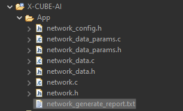

# Riproduzione *TynyML-based approach for Remaining Useful Life Prediction of Turbofan Engines*

L'obiettivo di questo lavoro è ricreare i modelli di proposti all'interno del paper di cui sopra i quali si propongono di calcolare il valore di **RUL** (*Remaining Useful Life*) per quanto riguarda dei motori a reazione proposti dalla **NASA** all'interno del dataset <a href="https://data.nasa.gov/Aerospace/CMAPSS-Jet-Engine-Simulated-Data/ff5v-kuh6">C-MAPSS Aircraft Engine Simulator Data</a>. 

## Descrizione del dataset

Data sets consists of multiple multivariate time series. Each data set is further divided into training and test subsets. Each time series is from a different engine i.e., the data can be considered to be from a fleet of engines of the same type. Each engine starts with different degrees of initial wear and manufacturing variation which is unknown to the user. This wear and variation is considered normal, i.e., it is not considered a fault condition. There are three operational settings that have a substantial effect on engine performance. These settings are also included in the data. The data is contaminated with sensor noise.

I data sets consistono di diverse serie temporali multivariate, ogni data set è poi diviso in una parte di *training* e una parte di *test*. Ogni serie temporale proviene da un diverso motore, di conseguenza i dati possono essere considerati come provenienti da una serie di motori della stessa tipologia. Ogni motore comincia con un diverso tipo di degrado iniziale e con alcune differenze a livello di fattura che non sono note all'utente (il degrado iniziale e le variazioni tra un motore e l'altro non sono considerate una condizione di *"fault"*). Ci sono tre *operational settings* le quali hanno un effetto sostanziale sulla performance del motore (queste vengono incluse nei dati). 

All'inizio di ogni serie temporale il motore opera normalmente e sviluppa un problema a un certo punto durante la serie. All'interno del *training set* il problema cresce fino a rendere il sistema inutilizzabile; nel *test set* la serie temporale si conclude prima che il sistema vada in stato di *failure*. 

L'obiettivo è quello di predirre il numero di cicli operazionali rimanenti prima che avvenga un fallimento per quanto riguarda i dati presenti nel test set. Per verificare l'inferenza della rete all'interno della cartella del dataset sono presenti i file *RUL_FD001-4.txt* i quali contengono i valori della RUL per ogni unità operativa (per ogni motore)

Ogni file del dataset è un file di testo composto da 26 colonne di numeri separate da spazi. Ogni riga rappresenta lo snapshot dei dati raccolti durante un singolo ciclo operazionale, ogni colonna è una differente variabile. 

- Data Set: FD001
Train trjectories: 100
Test trajectories: 100
Conditions: ONE (Sea Level)
Fault Modes: ONE (HPC Degradation)

- Data Set: FD002
Train trjectories: 260
Test trajectories: 259
Conditions: SIX
Fault Modes: ONE (HPC Degradation)

- Data Set: FD003
Train trjectories: 100
Test trajectories: 100
Conditions: ONE (Sea Level)
Fault Modes: TWO (HPC Degradation, Fan Degradation)

- Data Set: FD004
Train trjectories: 248
Test trajectories: 249
Conditions: SIX
Fault Modes: TWO (HPC Degradation, Fan Degradation)

Ci sono 6 condizioni (o combinaizoni di esse) che possono verificarsi: 
- Condition 1: Altitude = 0, Mach Number = 0, TRA = 100
- Condition 2: Altitude = 10, Mach Number = 0.25, TRA = 100
- Condition 3: Altitude = 20, Mach Number = 0.7 TRA = 100
- Condition 4: Altitude = 25, Mach Number = 0.62, TRA = 60
- Condition 5: Altitude = 35 Mach Number = 0.84, TRA = 100
- Condition 6: Altitude = 42, Mach Number = 0.84, TRA = 100

Per quanto riguarda i datasets abbiamo: 

- FD001: **soltanto** condizione 1

- FD002: **Mix** di tutte le condizioni 

- FD003: **soltanto** condizione 1

- FD004: **Mix** di tutte le condizioni

Le colonne corrispondono a

1) unit number
2) time, in cycles
3) operational setting 1
4) operational setting 2
5) operational setting 3
6) sensor measurement 1
7) sensor measurement 2 
[...]
'26') sensor measurement 21

## La riproduzione

### Caricamento dei dati e prima elaborazione (1-4)

Il caricamento dei dati in memoria viene effettuato utilizzando le librerie *Pandas* e *NumPy*, i dati vengono caricati in 4 dataframe i quali corrispondono ai vari FD001-4.txt che si trovano all'interno del dataset. 
Essi vengono tenuti separati per semplicità di confronto con il paper di cui sopra. 
<figure>
 

<figcaption align='center'><i>Rappresentazione grafica della lista train</i></figcaption>
</figure>

#### Considerazioni sui sensori (5-15)
All'interno della sezione di *Data Preprocessing* del paper in esame viene detto:

>After reviewing all sensors, it is found that some of them
have constant values, hence we can remove them. Therefore,
14 sensors remained for each sub-dataset (sensor 2, 3, 4, 7,
8, 9, 11, 12, 12, 13, 14, 15, 17 and 20).

**Tuttavia** come appreso tramite l'analisi dei dati all'interno del training set ciò non è vero per ogni parte componente il dataset. 

È invece vero per quanto riguarda **FD001 e FD003**. La causa è probabilmente da ricercarsi in quanto detto pocanzi per quanto riguarda le condizioni di volo registrate dai sensori, si ricorda infatti che FD001 e FD003 rappresentano voli in condizioni **costanti** mentre FD002 e FD004 ne rappresentano altri in condizioni **miste**. 

Riportiamo i grafici che rappresentano i valori dei sensori rispettivamente in FD001 e FD002:

<figure>

<figcaption align='center'><i>Sensori FD001</i></figcaption>
</figure>

<figure>

<figcaption align = 'center'><i>Sensori FD002</i></figcaption>
</figure>

Gli autori del paper hanno preso la decisione di eliminarli da ogni componente del dataset. La *ratio* che li ha portati a questa decisione non si evince dal documento, tuttavia si potrebbe ipotizzare che i valori di quei sensori siano costanti per ogni condizione e che quindi rappresentino una *"sommatoria di tratti costanti a seconda della condizione di volo"*, ma questa rimane comunque soltanto un'ipotesi. 

Per correttezza nella riproduzione (e per rendere i risultati maggiormente comparabili) abbiamo scelto di rimuovere gli stessi sensori anche noi. 

I sensori rimossi sono: 
- Sensor 1
- Sensor 5 
- Sensor 10 
- Sensor 16
- Sensor 18
- Sensor 19

### Min Max Scaling (16-24)

Dato che i sensori sono affetti da rumore si è deciso di applicare del Min Max scaling. Ciò viene effettuato tramite l'oggetto **MinMaxScaler** presente nella libreria *sklearn* il quale si occuperà di effettuare l'operazione su ogni dataframe istanziato all'interno della lista *train*. 
Per sicurezza abbiamo verificato che la distribuzione dei dati non fosse cambiata a seguito di qualche errore nel codice. Riportiamo  di seguito i grafici delle distribuzioni dei dati dei vari sensori prima e dopo lo scaling: 

<figure>

<figcaption align='center'><i>Distribuzione FD001 pre-scaling</i></figcaption>
</figure>

<figure>

<figcaption align='center'><i>Distribuzione FD001 post-scaling</i></figcaption>
</figure>

NB:*Tutti i grafici sono stati realizzati tramite le librerie Seaborn e Matplotlib di Python*

### Modelli

Gli autori del paper che stiamo cercando di riprodurre propongono come migliori modelli due reti **LSTM** (Long Short Term memory) una di dimensioni ridotte mentre l'altra full size, esse sono rappresentate come segue:

Model: "sequential_1"
_________________________________________________________________
 Layer (type)                Output Shape              Param 
=================================================================
 lstm_4 (LSTM)               (None, 30, 60)            18240     
                                                                 
 lstm_5 (LSTM)               (None, 30, 30)            10920     
                                                                 
 flatten_1 (Flatten)         (None, 900)               0         
                                                                 
 dense_3 (Dense)             (None, 30)                27030     
                                                                 
 dense_4 (Dense)             (None, 15)                465       
                                                                 
 dense_5 (Dense)             (None, 1)                 16        
                                                                 
=================================================================
Total params: 56,671
Trainable params: 56,671
Non-trainable params: 0
_________________________

Layer (type)                Output Shape              Param #   
=================================================================
 lstm (LSTM)                 (None, 30, 128)           73728     
                                                                 
 dropout (Dropout)           (None, 30, 128)           0         
                                                                 
 lstm_1 (LSTM)               (None, 30, 64)            49408     
                                                                 
 dropout_1 (Dropout)         (None, 30, 64)            0         
                                                                 
 lstm_2 (LSTM)               (None, 30, 32)            12416     
                                                                 
 dropout_2 (Dropout)         (None, 30, 32)            0         
                                                                 
 lstm_3 (LSTM)               (None, 30, 16)            3136      
                                                                 
 dropout_3 (Dropout)         (None, 30, 16)            0         
                                                                 
 flatten (Flatten)           (None, 480)               0         
                                                                 
 dense (Dense)               (None, 64)                30784     
                                                                 
 dense_1 (Dense)             (None, 32)                2080      

Total params: 171,585
Trainable params: 171,585
Non-trainable params: 0

durante la nostra riproduzione verranno chiamate LSTMsmallModel e LSTMlargeModel.
Verranno inoltre valutate tramite RMSE e tramite una funzione asimmetrica come metriche per il punteggio. 

Come iperparametri troviamo: 
- Optimizer: Adam 
- Initial learning rate: 0.1 
- Epochs: 50, 100, 80, 150
- Batch size: 256
- Alpha value: 

***Funzione di Score:***
$$
Score = \begin{cases} \sum^{N}_{n=1} e^{\frac {-d_i} {13}} - 1   , & \text{if} \space \space d_i \lt 0 \\
\sum^{N}_{n=1} e^{\frac {d_i} {10}} - 1, &\text{otherwise} \space \space \end{cases}
$$

<figure>
</img>
<figcaption align= 'center'>Score value as the error increases. The score is
calculated using the scoring function where late predictions receive higher penalisation </figcaption>
</figure>

***RMSE:***

$$
RMSE = \sqrt{\frac{1}{N}\sum^N_{i=1} d_i^2}
$$

Vengono inoltre applicate dagli autori delle ottimizzazioni ulteriori per quanto riguarda i modelli di cui sopra ai fini di una minor richiesta di risorse, il che risulta cruciale ai fini di un approccio di tipo TinyML. 

I modelli sono stati sviluppati utilizzando la libreria *Tensorflow* di python e il dataset è stato diviso utilizzando il criterio 80/20, il che significa che l'80% dei dati di training è stato utilizzato per l'addestramento mentre la parte rimanente è stata utilizzata per la *validazione* in fase di addestramento.

### Considerazioni post addestramento dei modelli

Abbiamo deciso inizialmente di addestrare i modelli su tutti i dati disponibili contemporaneamente tuttavia dal paper che stiamo cercando di riprodurre sembra che l'addestramento dei modelli sia stato reiterato per ognuna delle componenti del dataset in maniera separata. 

Ovvero ad esempio la rete LSTM *"piccola"* è stata addestrata prima sui dati di FD001, poi su quelli di FD002 e così via... 

Ciò a primo impatto è sembrato strano e si è tentato un approccio che cercasse di fare in modo che tutti i dati contemporaneamente fossero utilizzabili per l'addestramento, tuttavia ciò non ha portato a risultati soddisfacenti, di conseguenza proveremo a creare reti addestrate specificamemnte sulle varie componenti del datast. 

### Proposte per il miglioramento 

Una proposta per il miglioramento di questo tipo di condizione potrebbe essere quella di dividere il dataset in due parti, da un lato avremmo le due componenti a condizioni costanti, ovvero: 
- FD001 
- FD003

mentre dall'altra avremmo le due componenti in condizioni miste: 
- FD002
- FD004

A questo punto addestrare su questi due gruppi di dati due reti separate e, in seguito creare un'ultima rete (un **classificatore**), il quale dovrebbe avere lo scopo di indirizzare i dati verso la rete che è più adatta a calcolare la RUL. 
Questa idea tuttavia presenta dei problemi di fondo che riguardano l'input delle reti di tipo LSTM. 

Una rete di questo tipo ha bisogno di un input del seguente tipo: 
- Campioni
- *Time Steps* 
- *Features* 

I time steps sarebbero il numero di campioni per ogni sequenza di dati passati alla rete. Ciò significa che il classificatore dovrebbe analizzare i dati in batch da *time steps* elementi e classificarli tutti insieme allo stesso modo il che potrebbe comportare degli errori e dei problemi. 

Nel paper che stiamo cercando di riprodurre la dimensione del vettore di input alla rete è la seuente: 
(batch_size, 30, 14). 

### Aggiornamenti 18/09/23

I risultati che otteniamo non si avvicinano per nulla con quelli ottenuti dagli autori del paper che stiamo cercando di riprodurre, ciò ci porta a pensare che il modo in cui elaboriamo i dati prima di darli in input alle reti neurali non sia ottimale, in particolare abbiamo: 

> Last cycles of an engine life are more significant than the initial cycles. Thus, a piecewise linear RUL function is applied, where a max RUL value is set if the true RUL is greater than LSTM this max value, as shown in Eq. 2. In this way, we ignore data whose true RULs are greater than the maximum limit to pay attention to the degradation data and we adopt a max RUL value of **125**, as used in [<a href='https://ieeexplore.ieee.org/abstract/document/8998569?casa_token=m6jBHKB0s_4AAAAA:qt23ITJDbDXkIeKp7wxjpRmv3OlJRg3otquWxHHAr1zO_nx1AwkSb5kNiqVw0S5gB_tAFjuv'>19</a>] and other related works.

Per di più anche la funzione di loss deve essere modificata in favore di una che sia maggiormente adatta alle nostre esigenze rispetto all'RMSE. In particolare abbiamo: 
$$
    Loss = \begin{cases} 2ad_i , & \text{if} \space \space d_i \lt 0 \\
    2(a+(1-2a))d_i, &\text{otherwise} \space \space \end{cases}
$$

Per come viene descritta nel seguente paper: <a href = 'https://ieeexplore.ieee.org/abstract/document/9207051?casa_token=mj5ETeDbMFIAAAAA:ZCf8jWyvO0wN6k7igZNQtXoMJGq5dSqb7YYiaeHxqL7M5L0Y1jkyrk8HzGxoq3_bnmy7tOHI'>Asymmetric loss
functions for deep learning early predictions of remaining useful life in
aerospace gas turbine engines,</a>

Una funzione asimmetrica di questo tipo è necessaria ai fini di penalizzare le predizioni che vanno oltre la RUL effettiva.

Una volta effettuate le precedenti modifiche bisogna comprendere il motivo per cui non viene implementata correttamente la funzione di score custom che abbiamo implementato 

#### Il problema della funzione di loss: 
Ovviamente la funzione di loss per come scritta sopra non potrebbe funzionare correttamente. Posto $d_i$ come la differenza tra il valore predetto e il valore corretto di RUL ($d_i = y_{pred} - y_{true}$) nel caso in cui y_true fosse maggiore ci ritroveremmo ad avere un valore della funzione di loss negativo, il che sarebbe fuorviante per l'apprendimento della rete. 

Ci teniamo a precisare che la funzione scritta sopra è riportata esattamente per come scritta all'interno dell'articolo, il quale tuttavia fa riferimento ad un <a href = 'https://ieeexplore.ieee.org/abstract/document/9207051?casa_token=mj5ETeDbMFIAAAAA:ZCf8jWyvO0wN6k7igZNQtXoMJGq5dSqb7YYiaeHxqL7M5L0Y1jkyrk8HzGxoq3_bnmy7tOHI'>secondo documento</a> il quale la riporta in questa maniera: 

$$
    Loss = \begin{cases} 2a(\hat y_i - y_i )^2 , & \text{if} \space \space d_i \lt 0 \\
    2(a+(1-2a))(\hat y_i - y_i )^2, &\text{otherwise} \space \space \end{cases}
$$

La ovvia differenza è data dai quadrati i quali risolvono il problema descritto sopra. 

Il documento di cui sopra non si limita a descrivere l'utilizzo di questa specifica funzione di loss ma fornisce innanzitutto un discreto *background* sulle funzioni di loss asimmetriche le quali possono risultare estremamente utili per quanto riguarda l'addestramento di modelli con l'obiettivo di calcolare la vita rimanente utile di un elemento in condizioni critiche. 

In particolare, la funzione di cui sopra è definita come *Quadratic-Quadratic*(QUAD - QUAD) ma si fa riferimento anche a *Mean Square Logarithmic Error-Mean Square Error* (MSLE-MS), *Linear-Mean Square Error* (LIN-MSE), Linear-Linear(LIN-LIN) le quali potrebbero risultare utili in altri contesti applicativi e magari con altri set di dati.

### Aggiornamenti 20/09/23

A seguito dell'addestramento delle due reti LSTM che abbiamo descritto in precedenza per quanto riguarda la componente FD001 del datast abbiamo ottenuto i seguenti risultati per quanto riguarda la funzione di loss: 
- Small LSTM: 2912.22192
- Large LSTM: 6115.06201

Questi risultati non sono ancora soddisfacenti poiché, come riportato all'interno del documento <a href = 'https://ieeexplore.ieee.org/abstract/document/9207051?casa_token=mj5ETeDbMFIAAAAA:ZCf8jWyvO0wN6k7igZNQtXoMJGq5dSqb7YYiaeHxqL7M5L0Y1jkyrk8HzGxoq3_bnmy7tOHI'>Asymmetric loss
functions for deep learning early predictions of remaining useful life in
aerospace gas turbine engines</a>, il nostro target dovrebbe attestarsi intorno a **1647.3**

Nonostante la distanza si aggiri intorno al 10%, e di conseguenza i risultati siano tutto sommato comparabili, ciò è vero soltanto per la *Small LSTM*, il che è in controtendenza rispetto ai risultati ottenuti nel paper che stiamo cercando di riprodurre. Una separazione così drastica non è giustificabile e, prima di procedere ulteriormente con un confronto più approfondito alla luce delle metriche che gli autori hanno utilizzato ho deciso di mettere in luce alcune criticità della nostra particolare applicazione.

#### La data preparation
Il processo di data preparation si svolge come segue: 
1. Vengono raccolte le varie componenti del dataset in data frames
2. Vengono rimossi i sensori "*inutili*"
3. **Vengono divisi i dati**
3. Vengono formattati per essere dati in input durante la fase di addestramento. 

Risulta particolarmente critico il punto 3.

Cito testualmente: 
> Thus, a piecewise linear RUL function is applied,
where a max RUL value is set if the true RUL is greater than
this max value, as shown in Eq. 2. In this way, we ignore data
whose true RULs are greater than the maximum limit to pay
attention to the degradation data and we adopt a max RUL
value of 125, as used in [19] and other related works

Una tale funzione non è stata da noi implementata poiché non risultava chiaro il suo funzionamento e il proposito che perseguiva.
Ciò è stato chiarito dal documento: <a href = 'https://ieeexplore.ieee.org/abstract/document/9207051?casa_token=mj5ETeDbMFIAAAAA:ZCf8jWyvO0wN6k7igZNQtXoMJGq5dSqb7YYiaeHxqL7M5L0Y1jkyrk8HzGxoq3_bnmy7tOHI'>Asymmetric loss
functions for deep learning early predictions of remaining useful life in
aerospace gas turbine engines</a> il qale afferma: 

>Furthermore, the value of the maximum cycle s capped at 100 and remained constant until degradation has
occur as shown in Fig 2. This allows the deep learning models
to differentiate between the healthy state (RUL = 100) and
unhealthy state (RUL < 100). Even though degradation can
happen randomly, the early stages of engine cycle are assumed
to be usable and functional. The labels are the RUL cycle for
each instance of the data.

<figure>

<figcaption align='center'>Maximum RUL of gas turbine engine are capped to
100 cycle to distinguish the healthy state and degradation state
during preprocessing stage.</figcaption>
</figure>

Nel caso del paper che stiamo cercando di riprodurre questo valore andrebbe settato a 125. 

Proseguendo in questa direzione inoltre una ulteriore accortezza va rispettata: 

>Finally, after the aforementioned data preprocessing steps,each train set is splitted into the following datasets: train (for ML model building) and validation (for ML model to validateon unseen data) with a 80/20% split, **with caution that the segment of each engine is not separated**

Nonostante la maggior parte del paragrafo precedente sia stata rispettata, non abbiamo tuttavia tenuto conto dell'importanza nel non separare i dati dello stesso motore, i quali, invece, sicuramente si "mescolano" seguendo l'algoritmo da noi proposto. 

Il prossimo passo quindi è quello di comprendere come elaborare i dati nella maniera in cui gli autori hanno pensato di elaborarli poiché non è l'unico lavoro che fa riferimento a questo tipo di data preparation per questo dataset. 

### Aggiornamenti 26/09/2023 

La funzione per il calcolo della RUL in fase di training (ovvero per calcolare i label dei valori del dataset) sembra essere qualcosa di universalmente accettato lavorando su questo dataset. 

Per quanto riguarda l'applicazione pratica, procediamo come segue: 
- Innanzitutto creiamo un nuovo notebook in cui ricaricare il tutto, così da conservare i risultati del vecchio che potrebbero essere utili

- Dopodiché implementiamo la funzione lineare a tratti facendo in modo che, una volta trattati i dati che devono essere di dimensione (*batch_size*, 30, 14) il valore corrispettivo della RUL sia al massimo 100 e cominci a diminuire quando effettivamente supera il valore desiderato. (Quindi nei primi 100 cicli il valore della RUL sarà sempre 100 piuttosto che valori superiori). 

L'unico problema rimane sempre quello di fare in modo che, durante la selezione dei campioni facenti parte di una sequenza, essi facciano sempre riferimento alla stessa unità e non ne vengano mischiate di successive. 

<figure>

<figcaption align='center'>Problema della finestra con diversi unit number</figsize>
</figure>

<a href = 'https://github.com/biswajitsahoo1111/rul_codes_open/tree/master'>Link</a>

#### La *piecewise-linear function*

La funzione *process_targets* all'interno del file <a href='Riproduzione_PW/riproduzione_pw.ipynb'>*riproduzione_pw*</a> è la cosiddetta funzione **lineare a tratti** di cui parliamo estensivamente all'interno del readme ci permette dunque di calcolare il valore della RUL da assegnare ad ogni elemento del dataset. 
La funzione prende in input la lunghezza totale dei dati e la *"early_rul"* la quale rappresenta il valore massimo possibile di RUL (imponiamo ciò poiché come descritto dalla letteratura dovrebbe permettere alla rete di comprendere meglio quando il componente è in salute o meno), il quale poi viene decrementato in maniera lineare quando la *"data_length"* supera il valore di *early_rul*. La funzione che abbiamo appena descritto si trova all'interno della cella *[4]* del file linkato in precedenza.

#### La funzione di *generazione delle sequenze* 

Come abbiamo già abbondantemente sottolineato, per poter lavorare con sequenze temporali di questo tipo e, soprattutto, per poterlo fare con reti di tipo LSTM, abbiamo bisogno di dividere i dati in sequenze da $n$ elementi. In questo caso, come da istruzioni (e da stato dell'arte) abbiamo posto un valore per la lunghezza delle sequenze di 30 elementi. 

La funzione che fa ciò si chiama *process_input_data_with_targets*, la quale crea le strutture dati necessarie a contenere i dati nella forma corretta, ovvero sequenze da 30 elementi con passo 1. Stavolta tutto il procedimento è fatto in maniera manuale piuttosto che con la funzione *pad_sequences* di *keras*
146.14778

### Aggiornamenti 2/10/23

#### LSTM Small
Siamo riusciti a creare un modello di small LSTM che abbia delle metriche abbastanza soddisfacenti e paragonabili con quelle che sono state riportate dal paper che stiamo cercando di riprodurre. 
Il modello small LSTM a, seguito delle modifiche apportate al codice di preparazione dei dati, è riuscito ad ottenere un valore per la funzione di loss pari a: loss: 156.5530, il che è ottimo, soprattutto se messo in correlazione con il documento <a href = 'https://ieeexplore.ieee.org/abstract/document/9207051?casa_token=mj5ETeDbMFIAAAAA:ZCf8jWyvO0wN6k7igZNQtXoMJGq5dSqb7YYiaeHxqL7M5L0Y1jkyrk8HzGxoq3_bnmy7tOHI'>Asymmetric loss
functions for deep learning early predictions of remaining useful life in
aerospace gas turbine engines</a> in cui il valore della funzione di loss perquesto stesso tipo di rete era pari a 1647.3.

Attenzione però, i risulati ottenuti al momento riguardano esclusivamente la fase di training e validation, non di testing. 
Tuttavia il valore della funzione di loss in fase di validazione può essere un buon metro per comprendere se la rete ha generalizzato in maniera corretta o meno e, in questo caso il valore della Loss in fase di validazione è di 146.14 per la nostra LSTM_small.

Adesso andranno condotti test utilizzando RMSE e l'S score come definiti pocanzi, ovvero: 

$$
S \space score = \begin{cases} \sum^{N}_{n=1} e^{\frac {-d_i} {13}} - 1   , & \text{if} \space \space d_i \lt 0 \\
\sum^{N}_{n=1} e^{\frac {d_i} {10}} - 1, &\text{otherwise} \space \space \end{cases}
$$

$$
RMSE = \sqrt{\frac{1}{N}\sum^N_{i=1} d_i^2}
$$

per poter avere un preciso confronto con i valori ottenuti 

#### LSTM large 
Per quanto riguarda questo tipo di rete abbiamo dovuto modificare abbondantemente il codice. Innanzitutto presentiamo la specifica configurazione utilizzata per ottenere i risultati esposti in precedenza per la rete **LSTM small**:

- Optimizer: Adam
- Initial learning rate: 0.1 (Quello consigliato sarebbe 0.01)
- Nessun LR scheduler
- Batch size: 256
- $\alpha$ = 0.2 

NB: Ricordiamo che $\alpha$ è un coefficiente specifico per la funzione di loss che stiamo adottando, la $QUAD - QUAD$. 

Per quanto riguarda l'addestramento della rete **LSTM Large** abbiamo invece: 

- Optimizer: Adam
- Initial learning rate: 0.01
- LR Scheduler il quale divide per 10 il learning rate ogni 30 epoche
- Batch size: 256
- $\alpha$ = 0.4

Un **learning rate scheduler** in TensorFlow è una tecnica utilizzata per regolare automaticamente il tasso di apprendimento (learning rate) durante il processo di addestramento di una rete neurale. Il tasso di apprendimento è un parametro critico nella fase di ottimizzazione dei modelli di machine learning, poiché influenza quanto velocemente il modello impara dai dati di addestramento.
Nel nostro caso, avendo un elevato numero di epoche (100 per la LSTM large) il pericolo è quello dell'overfitting, modificare dinamicamente il learning rate diminuendolo ogni 30 epoche (in questo caso) ci permette di diminuire questo rischio. 

In particolare il nostro è fatto nella seguente maniera:

~~~ Python
def scheduler(epoch, lr):
    if epoch < 30:
        return lr
    elif epoch >= 30 and epoch < 60 :
        return 0.001
    elif epoch >= 60 and epoch < 90: 
        return 0.0001
    elif epoch >= 90: 
        return 0.00001
    else: 
        return 0.01; 
    

lr_scheduler = tf.keras.callbacks.LearningRateScheduler(scheduler, verbose = 1)
~~~

I risultati ottenuti da questa rete sono stati: 
- loss: 127.6987 
- custom_score: 625.6381 
- val_loss: 125.9037 
- val_custom_score: 564.4070 
- lr: 1.0000e-05

In questo caso possiamo fare già dei paragoni con il lavoro svolto all'interno del paper poiché siamo riusciti a sistemare anche il funzionamento della funzione di S-score, la quale è stata implementata direttamente in fase di addestramento e mostra il suo risultato sotto il nome di *custom_score*. 
In particolare il *val_custom_score* non si discosta di molto rispetto a quello proposto dagli autori del paper che stiamo riproducendo, il quale si attesta sul valore di 446.89 per la variante non ottimizzata, come la nostra. 

Prossimi passi: 

Ottenere una versione definitiva della LSTM_small riaddestrando come fatto per LSTM_large. 

### Aggiornamenti 9/10/23

Sono stati aggiunti grafici che mostrano l'andamento dell'S-Score e della funzione di loss sia in fase di training che di validation all'interno del file <a href='Riproduzione_PW/riproduzione_pw_small.ipynb'>riproduzione_pw_small</a> e <a href='Riproduzione_PW/riproduzione_pw_large.ipynb'>riproduzione_pw_large</a>

Ciò che avviene in maniera interessante è che da un certo punto in poi è visibile come il valore dell'S-Score in fase di validazione sia solitamente sempre minore dell'S-Score in fase di Training, ciò è probabilmente dovuto al fatto che la rete tende (per i dati mai visti) ad avere un comportamento maggiormente conservativo quindi a *sbagliare con previsioni in anticipo piuttosto che in ritardo*. 

Come è possibile infatti evincere dai grafici, per quanto riguarda la rete LSTM Large abbiamo che dall'epoca 25 circa il valore dell'S-Score in fase di validazione è costantemente minore del corrispettivo in fase di training. 

<figure>

<figcaption align='center'>Andamento dell'S-Score in fase di training e di validation per l'addestramento della LSTM Large su FD001</figcaption>
</figure>

Lo stesso avviene per la rete LSTM small 

<figure>

<figcaption align='center'>Andamento dell'S-Score in fase di training e di validation per l'addestramento della LSTM small su FD001</figcaption>
</figure>

Per quanto riguarda, invece l'andamento della funzione di loss non c'è molto da sengalare, tuttavia il suo valore sembra assestarsi abbastanza presto, il che, avendo un elevato numero di epoche in fase di addestramento, potrebbe portare ad overfitting

<figure>

<figcaption align='center'>Andamento della funzione di loss in fase di training e di validation per l'addestramento della LSTM Large su FD001</figcaption>
</figure>

<figure>

<figcaption align='center'>Andamento della funzione di loss in fase di training e di validation per l'addestramento della LSTM Small su FD001</figcaption>
</figure>

### AI su NUCLEO 

Ora che abbiamo disponibilità di due modelli con prestazioni comparabili con quelle ottenute da chi ha steso il documento che stiamo cercando di riprodurre possiamo provare a fare il deploy su microcontrollore, al momento siamo a conoscenza di 3 tecniche per fare ciò:

1. **Utilizzare l'IDE fornito da STM con il suo pacchetto XCUBE-AI** 
2. **Utilizzare Tensorflow come libreria per poter fare il deploy del modello su MCU** 
3. **Sfruttare il sistema operativo MbedOS che si trova all'interno dell´MCU**

*NB: l'MCU su cui stiamo lavorando è una NUCLEO-F446RE*

Abbiamo provato a cominciare con il primo metodo tuttavia cercando di caricare il modello tramite XCUBE-AI otteniamo il seguente errore: 

*[NOT IMPLEMENTED: Unsupported layer types: FlexTensorListStack, FlexTensorListReserve, WHILE, stopping.]*

Dopo qualche ricerca si è compreso come ciò derivi dalla struttura che viene data alla rete a seguito della conversione in formato *.tflite*, ovvero la seguente: 

<figure>

<figcaption align='center'>Grafico della rete convertita in tflite</figcaption>
</figure>

In questo caso la rete è stata convertita utilizzando il seguente codice: 
~~~ Python
converter2 = tf.lite.TFLiteConverter.from_keras_model(large_lstm)
converter2.target_spec.supported_ops = [
  tf.lite.OpsSet.TFLITE_BUILTINS, # enable TensorFlow Lite ops.
  tf.lite.OpsSet.SELECT_TF_OPS # enable TensorFlow ops.
]
lstm_large = converter2.convert()
with open("large_lstm.tflite", "wb") as f:
    f.write(lstm_small_tflite)
~~~

tuttavia, modificandolo nel seguente modo e utilizzandolo *direttamente* (senza caricare il modello in memoria dall'esterno ma nello stesso notebook in cui avviene l'addestramento) otteniamo:
~~~ Python
MODEL_DIR = '/home/aliquodfahriam/tinyML/Riproduzione/Riproduzione_PW/models/LSTMlarge/FD0001'
run_model = tf.function(lambda x: LSTMlargeModel(x))
BATCH_SIZE = 256
STEPS = 30
INPUT_SIZE = 14

concrete_func = run_model.get_concrete_function(
    tf.TensorSpec([BATCH_SIZE, STEPS, INPUT_SIZE], LSTMlargeModel.inputs[0].dtype)
)
converter = tf.lite.TFLiteConverter.from_keras_model(LSTMlargeModel)
converter.target_spec.supported_ops = [
  tf.lite.OpsSet.TFLITE_BUILTINS, # enable TensorFlow Lite ops.
  tf.lite.OpsSet.SELECT_TF_OPS # enable TensorFlow ops.
]

LSTMlargeModel.save(MODEL_DIR, save_format="tf", signatures = concrete_func )

converter = tf.lite.TFLiteConverter.from_saved_model(MODEL_DIR)
tflite_model = converter.convert()

with open("large_lstm.tflite", "wb") as f:
    f.write(tflite_model)
~~~

Con cui abbiamo ottenuto una rete che può fare a meno dei layers *FlexTensorListStack* e *FlexTensorListReserve* che erano stati creati in fase di conversione. 

<figure>

<figcaption align='center'>Grafico della rete convertita in tflite in maniera corretta</figcaption>
</figure>

di cui deve ancora essere testata l'effettiva funzionalità in combinazione con XCUBE-AI. X-CUBE-AI è un Pacchetto di Espansione STM32Cube, che fa parte dell'ecosistema STM32Cube.AI. Estende le capacità di STM32CubeMX con la conversione automatica di algoritmi di intelligenza artificiale preaddestrati, inclusi modelli di reti neurali e di apprendimento automatico classico. Integra anche una libreria ottimizzata generata nel progetto dell'utente.
Il modo più semplice per utilizzare X-CUBE-AI è scaricarlo all'interno del tool STM32CubeMX (versione 5.4.0 o successiva), come descritto nel manuale dell'utente "Introduzione al Pacchetto di Espansione X-CUBE-AI per l'intelligenza artificiale (AI)" (UM2526).

Il Pacchetto di Espansione X-CUBE-AI offre anche diversi modi per convalidare gli algoritmi di intelligenza artificiale sia su un PC desktop che su un STM32. Con X-CUBE-AI, è anche possibile misurare le prestazioni sui dispositivi STM32 senza alcun codice C specifico creato dall'utente.
#### XCUBE-AI
X-CUBE-AI è un Pacchetto di Espansione STM32Cube, che fa parte dell'ecosistema STM32Cube.AI. Estende le capacità di STM32CubeMX con la conversione automatica di algoritmi di intelligenza artificiale preaddestrati, inclusi modelli di reti neurali e di apprendimento automatico classico. Integra anche una libreria ottimizzata generata nel progetto dell'utente.
Il modo più semplice per utilizzare X-CUBE-AI è scaricarlo all'interno del tool STM32CubeMX (versione 5.4.0 o successiva), come descritto nel manuale dell'utente "Introduzione al Pacchetto di Espansione X-CUBE-AI per l'intelligenza artificiale (AI)" (UM2526).

Il Pacchetto di Espansione X-CUBE-AI offre anche diversi modi per convalidare gli algoritmi di intelligenza artificiale sia su un PC desktop che su un STM32. Con X-CUBE-AI, è anche possibile misurare le prestazioni sui dispositivi STM32 senza alcun codice C specifico creato dall'utente.

Differenze con il secondo e il terzo metodo: 
- XCUBE-AI è un progetto closed Source a differenza di Tensorflow
- Potrebbe essere la maniera più semplice di gestire la rete dato che non richiede di imbastire un progetto tensorflow né di utilizzare le sue specifiche librerie
- A quanto sembra dai risultati online è il metodo più efficiente e ottimizzato per funzionare con questo tipo di MCU. 
- Non bisogna per forza usare C++

#### Tensorflow on Board
In realtà i successivi due metodi sono parenti, per non dire identici. Nel primo caso bisogna cercare di utilizzare l'ide fornito da STM per imbastire un progetto tensorflow e utilizzare i file che vengono messi a disposizione in uno dei loro template come libreria per poter poi gestire i dati in input alla rete che deve a sua volta essere convertita da file *.tflite* a file *.h* da utilizzare tramite *include* di C 

Nel secondo caso vengono sfruttate le features fornite dalla board in quanto provvista di sistema operativo mbedOS e, tuttavia, anche in questo caso avremo bisogno di utilizzare un template di tensorflowLite e di modificarlo per adattarlo alle nostre esigenze. 

Abbiamo continuato il nostro approccio al primo punto ottenendo i seguenti risultati:

1. **NOT IMPLEMENTED: Batch size greater than 1 not implemented**

Siamo riusciti a risolvere questo problema semplicemente cambiando il runtime, il quale può essere settato su due impostazioni: 
- TFLite Micro Runtime
- STM32CubeAI.Runtime

Inizialmente abbiamo provato col secondo ottenendo l'errore di cui sopra, mentre con il primo riusciamo a portare a termine il processo di analisi, tuttavia otteniamo il seguente errore abbastanza autoesplicativo: 
<figure>
</img>
<figcaption align = 'center'>Il processo di analisi viene completato ma il modello viene indicato come troppo grande (e di molto) </figcaption>
</figure>

NB: Nel caso in cui il processo di analisi non venga completato al posto della spunta verde (nel bottone della scritta analyze) avremmo una X rossa.

<figure>
</img>
<figcaption align = 'center'>Fallimento dell'analisi, in basso l'output che lo conferma </figcaption>
</figure>

Tuttavia il risultato a cui siamo pervenuti va contro i risultati del paper che stiamo cercando di riprodurre i quali affermano che nella sua variante non ottimizzata il modello LSTM small occuperebbe soltanto 13KB di RAM e 224 KB di flash. 

### Aggiornamenti 16/10/2023

Considerando il codice che abbiamo presentato precedentemente per quanto riguarda il processo di conversione è assolutamente plausibile che non sia possibile allocare lo spazio necessario all'interno dell'MCU per il batch di input. 

La rete che abbiamo cercato di validare tramite gli strumenti forniti da *STM32CubeIDE* ha infatti una dimensione dell'input pari a 256x30x14, ovvero 256 minibatch da 30 elementi ciascuno, di cui ogni elemento è a sua volta composto da ben 14 features (ovvero le colonne che abbiamo selezionato dal dataset).

Modificando il parametro di batch size ad 1 la dimensione dell'input arriva a 1x256x14 ovvero un singolo minibatch da 30 elementi, ciascuno con 14 features. 

Questa modifica si è rivelata essere vincente portandoci ad avere i seguenti valori: 
- 240,87 KB di memoria Flash occupata
- **14,59 KB di memoria RAM occupata**

Abbiamo in questo modo dimezzato l'occupazione di memoria flash. Tuttavia il dato più interessante risulta essere quello dell'occupazione della RAM, la quale adesso è davvero vicina ai dati forniti dall'articolo di cui stiamo seguendo i passi. 

### Aggiornamenti 19/10/2023

A seguito di alcuni problemi dovuti all'aggiornamento del kernel sul sistema operativo siamo stati costretti a cambiare pc per qualche giorno. Ci teniamo a precisare che, nonostante la configurazione software sia esattamente la stessa, le performance delle reti neurali che riusciamo ad addestrare risultano di gran lunga diverse. 
Le configurazione dei due PC sono: 

**Portatile (Migliori risultati)** *Asus Zephyrus g14*: 
- Ryzen 7 4800HS 
- RTX 2060 MAX-Q 6GB 
- 1 TB SSD
- 32 GB RAM 

**PC Fisso**: 
- Ryzen 5 1600AF
- GTX 1080 8GB 
- 16 GB RAM 
- 1 TB + 500 GB + 120 GB SSD
- 500 GB HDD

Per quanto riguarda la configurazione software abbiamo seguito le medesime regole, le quali sono riassunte all'interno di <a href=''>questa guida di tensorflow</a>, in particolare abbiamo 

- Versione Driver NVIDIA per Linux: 535.113.01 
- Versione CUDA: 12.2
- Versione CUDA Toolkit: 12.2.2 
- Versione CUDNN: 8.9.5 (for CUDA 12)

*La versione di CUDA Toolkit è legata a doppio filo con la versione di CUDA che troviamo all'interno dei driver NVIDIA, nel caso la corrispondenza non fosse rispettata ci potrebbero essere problemi per quanto riguarda il caricamento stesso dei driver*. 

Di seguito lasciamo anche il resoconto dell'ambiente Python utilizzato in entrambi i casi per procedere con lo sviluppo: 
name: tf
channels:
  - conda-forge
  - defaults
dependencies:
  - _libgcc_mutex=0.1=main
  - _openmp_mutex=5.1=1_gnu
  - asttokens=2.4.0=pyhd8ed1ab_0
  - backcall=0.2.0=pyh9f0ad1d_0
  - backports=1.0=pyhd8ed1ab_3
  - backports.functools_lru_cache=1.6.5=pyhd8ed1ab_0
  - bzip2=1.0.8=h7b6447c_0
  - ca-certificates=2023.7.22=hbcca054_0
  - comm=0.1.4=pyhd8ed1ab_0
  - debugpy=1.6.7=py310h6a678d5_0
  - decorator=5.1.1=pyhd8ed1ab_0
  - entrypoints=0.4=pyhd8ed1ab_0
  - exceptiongroup=1.1.3=pyhd8ed1ab_0
  - executing=1.2.0=pyhd8ed1ab_0
  - ipykernel=6.25.2=pyh2140261_0
  - ipython=8.16.1=pyh0d859eb_0
  - jedi=0.19.1=pyhd8ed1ab_0
  - jupyter_client=7.3.4=pyhd8ed1ab_0
  - jupyter_core=5.4.0=py310hff52083_0
  - ld_impl_linux-64=2.38=h1181459_1
  - libffi=3.4.4=h6a678d5_0
  - libgcc-ng=11.2.0=h1234567_1
  - libgomp=11.2.0=h1234567_1
  - libsodium=1.0.18=h36c2ea0_1
  - libstdcxx-ng=11.2.0=h1234567_1
  - libuuid=1.41.5=h5eee18b_0
  - matplotlib-inline=0.1.6=pyhd8ed1ab_0
  - ncurses=6.4=h6a678d5_0
  - nest-asyncio=1.5.8=pyhd8ed1ab_0
  - openssl=3.0.11=h7f8727e_2
  - packaging=23.2=pyhd8ed1ab_0
  - parso=0.8.3=pyhd8ed1ab_0
  - pexpect=4.8.0=pyh1a96a4e_2
  - pickleshare=0.7.5=py_1003
  - pip=23.3=py310h06a4308_0
  - platformdirs=3.11.0=pyhd8ed1ab_0
  - prompt-toolkit=3.0.39=pyha770c72_0
  - prompt_toolkit=3.0.39=hd8ed1ab_0
  - psutil=5.9.0=py310h5eee18b_0
  - ptyprocess=0.7.0=pyhd3deb0d_0
  - pure_eval=0.2.2=pyhd8ed1ab_0
  - pygments=2.16.1=pyhd8ed1ab_0
  - python=3.10.13=h955ad1f_0
  - python-dateutil=2.8.2=pyhd8ed1ab_0
  - python_abi=3.10=2_cp310
  - pyzmq=25.1.0=py310h6a678d5_0
  - readline=8.2=h5eee18b_0
  - setuptools=68.0.0=py310h06a4308_0
  - six=1.16.0=pyh6c4a22f_0
  - sqlite=3.41.2=h5eee18b_0
  - stack_data=0.6.2=pyhd8ed1ab_0
  - tk=8.6.12=h1ccaba5_0
  - tornado=6.1=py310h5764c6d_3
  - traitlets=5.11.2=pyhd8ed1ab_0
  - typing-extensions=4.8.0=hd8ed1ab_0
  - typing_extensions=4.8.0=pyha770c72_0
  - wcwidth=0.2.8=pyhd8ed1ab_0
  - wheel=0.41.2=py310h06a4308_0
  - xz=5.4.2=h5eee18b_0
  - zeromq=4.3.4=h2531618_0
  - zlib=1.2.13=h5eee18b_0
  - pip:
      - absl-py==2.0.0
      - astunparse==1.6.3
      - cachetools==5.3.1
      - certifi==2023.7.22
      - charset-normalizer==3.3.0
      - contourpy==1.1.1
      - cycler==0.12.1
      - flatbuffers==23.5.26
      - fonttools==4.43.1
      - gast==0.5.4
      - google-auth==2.23.3
      - google-auth-oauthlib==1.0.0
      - google-pasta==0.2.0
      - grpcio==1.59.0
      - h5py==3.10.0
      - idna==3.4
      - joblib==1.3.2
      - keras==2.14.0
      - kiwisolver==1.4.5
      - libclang==16.0.6
      - markdown==3.5
      - markupsafe==2.1.3
      - matplotlib==3.8.0
      - ml-dtypes==0.2.0
      - numpy==1.26.1
      - **nvidia-cublas-cu11==11.11.3.6**
      - **nvidia-cuda-cupti-cu11==11.8.87**
      - **nvidia-cuda-nvcc-cu11==11.8.89**
      - **nvidia-cuda-runtime-cu11==11.8.89**
      - **nvidia-cudnn-cu11==8.7.0.84**
      - **nvidia-cufft-cu11==10.9.0.58**
      - **nvidia-curand-cu11==10.3.0.86**
      - **nvidia-cusolver-cu11==11.4.1.48**
      - **nvidia-cusparse-cu11==11.7.5.86**
      - **nvidia-nccl-cu11==2.16.5**
      - oauthlib==3.2.2
      - opt-einsum==3.3.0
      - pandas==2.1.1
      - pillow==10.1.0
      - protobuf==4.24.4
      - pyasn1==0.5.0
      - pyasn1-modules==0.3.0
      - pyparsing==3.1.1
      - pytz==2023.3.post1
      - requests==2.31.0
      - requests-oauthlib==1.3.1
      - rsa==4.9
      - scikit-learn==1.3.1
      - scipy==1.11.3
      - sklearn-model==0.0.6
      - tensorboard==2.14.1
      - tensorboard-data-server==0.7.1
      - **tensorflow==2.14.0**
      - tensorflow-estimator==2.14.0
      - tensorflow-io-gcs-filesystem==0.34.0
      - tensorrt==8.5.3.1
      - termcolor==2.3.0
      - threadpoolctl==3.2.0
      - tzdata==2023.3
      - urllib3==2.0.7
      - werkzeug==3.0.0
      - wrapt==1.14.1

Per quanto la scheda grafica RTX 2060 sia effettivamente più recente rispetto alla GTX 1080 la seconda ha un TDP di 180 watt mentre la prima di soli 65, ciò è ovviamente in relazioni alle dimensioni e ai consumi che un portatile può riuscire a raggiungere. 
Ciò che ci saremmo aspettati è tuttavia un semplice incremento di prestazioni in fase di addestramento (una scheda grafica più potente può riuscire a farci addestrare una rete in meno tempo), tuttavia in questo caso otteniamo anche un miglioramento delle prestazioni della rete senza alcun tipo di modifica. 

In particolare, nel caso del PC fisso abbiamo (per la rete LSTM small) una funzione di loss che rimane intorno a 1400 e un S-Score che rimane intorno ai 20000

Anche provando a cambiare ambiente usando *Tensorman* (ovvero un container docker il quale contiene tutto il necessario per l'utilizzo standalone di tensorflow + GPU) i risultati non migliorano, anzi peggiorano di molto portando la funzione di loss ad avere valori oltre i 4000. 

Comprendere a cosa sia dovuta questa disparità nei risultati non è immediato, tuttavia possiamo fare delle ipotesi. La RTX 2060 montata sul portatile ha 240 tensor cores, i quali sono specializzati nella computazione per questo tipo di task mentre la GTX 1080 non ne ha alcuno. Questa potrebbe essere la causa tuttavia non si trovano in letteratura casi del genere e considerazioni a riguardo. 

#### X-CUBE-AI problemi di validazione su target

Per quanto la validazione su desktop vada a buon fine, stiamo riscontrando problemi con la validazione su microcontrollore della nostra rete neurale che adesso si presenta come segue: 
<figure>

<figcaption align='center'>Notare come la dimensione dell'input è passata da 256x30x14 a 1x30x14</figcaption>
</figure>

Come già accennato la validazione della rete su desktop ci porta ad ottenere un risultato affermativo con un tempo di inferenza di 0.632 millisecondi. 

Tuttavia la validazione della rete sulla MCU ritorna un errore: 
*E200(ValidationError): stm32: Unable to bind the STM AI runtime with "lstm_small" c-model: [] 
 connection to "serial:115200"/"115200" run-time fail*

*E801(HwIOError): Invalid firmware - /dev/ttyACM0:115200*

### Aggiornamento 24/10/23

La cosa più interessante da fare potrebbe essere quella di provare uno degli esempi di tensorflow e controllare se il problema sta nella nostra rete o è qualcosa che ha effettivamente a che fare con la MCU. 
Procederemo utilizzando l'esempio giocattolo. 

I file dell'esempio che stiamo cercando di utilizzare possono esssere trovati all'interno della cartella Experimental, in particolare parliamo di *sine_wave.ipynb*, *sine_model.tflite* e 
sine_model.h

Abbiamo effettuato la prova anche con questo esempio senza successo, il lato positivo è che non si tratta di un problema della nostra rete, dunque. Il lato negativo è che la soluzione al problema rimane ignota. 

### Aggiornamento 25/10/23

Spulciando <a href='./X_CUBE_AI/en.DM00570145.pdf'> la documentazione di X-CUBE-AI</a> abbiamo trovato quanto segue: 
*The [Validate on target] option must be used only later when the targeted device is flashed with special
test application “AI Validation”. It must be selected during the previous step (step 3 of Section 4.1 Adding the X-
CUBE-AI component). Reported information and usage are fully described in Section 10 AI validation application.*

E ancora: 

*"[Validation on target]: this mode compares the DL model with the C model that runs on the targeted
device. It requires a special AI test application that embeds the generated NN libraries and the COM agent
to communicate with the host system. Output and usage are illustrated in Section 10 AI validation
application."*

A differenza di quello che pensavamo, la validazione su target fa un confronto tra il modello in c (convertito automaticamente dal file .tflite ) e il modello che viene fornito dall'utente in questa particolare fase (che ovviamente deve essere lo stesso modello tflite fornito in precedenza). 

Procediamo a questo punto da dove avevamo lasciato il lavoro andando a configurare il clock impostandolo a 180 MHz e salvando la configurazione ioc. A questo punto verrà automaticamente generato del codice aggiuntivo riguardante la parte che compete ad X-CUBE-AI. In particolare viene generata una directory che contiene quanto segue: 

<figure align='center'>

<figcaption align='center'>Contenuto della directory X-CUBE-AI generata automaticamente dall'IDE</figcaption>
</figure>

https://os.mbed.com/docs/mbed-os/v6.16/mbed-os-pelion/machine-learning-with-tensorflow-and-mbed-os.html

<a href="https://github.com/makinarocks/awesome-industrial-machine-datasets/blob/master/data-explanation/C-MAPSS/README.md">Awesome dataset description</a>

### Aggiornamenti 27/11/2023

A seguito di esperimenti effettuati sui dati di test ci siamo resi conto di come il modello che finora avevamo tentato di utilizzare fosse in gran parte affetto da overfitting, per tentare di risolvere il problema abbiamo riveduto e corretto la parte relativa alla preparazione dei dati. Quest'ultima è stata quindi determinante per la creazione del nuovo modello con cui siamo, invece, arrivati ad ottimi valori anche in fase di test. Riportiamo di seguito qualche immagine di confronto. 

 <figure>

<figcaption align='center'> Overfitting della Small LSTM originale</figcaption>
 </figure>

 <figure>
 
 <figcaption align='center'>Test sulla nuova rete Small addestrata con QUAD-QUAD <figcaption>
 </figure>
Abbiamo anche deciso di cambiare la funzione di loss per comprendere quanto la QUAD-QUAD incidesse realmente sulle performance della rete neurale. In questo senso otteniamo il grafico di seguito
 
 <figure>
 
 <figcaption align='center'>Test sulla nuova rete Small addestrata con MSE <figcaption>
 </figure>

 Per quanto riguarda i risultati numerici dell'S-Score e dell'RMSE otteniamo i seguenti valori, confrontati con i risultati dello stato dell'arte. 
 <figure>
 
 <figcaption align='center'>Tabella dei risultati<figcaption>
 </figure>

 Come è possibile notare dalle figure, il risultato cambia in maniera drastica.
 Per vedere tutti i grafici riferirsi al file <a href='../Riproduzione/Experimental/experiments_fixed.ipynb'>experiments_fixed.ipynb</a>

 Seguirà adesso una fase di nuova analisi dello stato dell'arte che ci permetta di arricchire il progetto. 
 
 #### Aggiornamenti 02/12/2023

Sono stati aggiunti due documenti all'interno della cartella apposita. 
- <a href = 'Documenti/Appuntati/Primer For TinyML Predictive Maintenance/A_Primer_for_tinyML_Predictive_Maintenance_Input_and_Model_Optimisation.pdf'>Primer For TinyML Predictive Maintenance</a>
- <a href = 'Documenti/Appuntati/RealTimePrediction/Real-time_Prediction_Method_of_Remaining_Useful_Life_Based_on_TinyML.pdf'>Real-time Prediction Method of Remaining Useful Life</a>

Il primo fornisce una panoramica più generale sul problema e qualche spunto di riflessione interessante, il riassunto dei punti salienti può essere trovato <a href='Documenti/Appuntati/Primer For TinyML Predictive Maintenance/A primer for tinyML predictive Maintenance.md'>qui</a>. 

Il secondo, invece, non ci fornisce informazioni interessanti dal punto di vista implementativo (come invece il titolo sembrerebbe suggerire). Presenta invece numerosi riferimenti ad altri lavori nell'ambito del TinyML che potrebbe essere interessante analizzare. 

A questo punto grazie al contributo di <a href = 'Documenti/Appuntati/Primer For TinyML Predictive Maintenance/A_Primer_for_tinyML_Predictive_Maintenance_Input_and_Model_Optimisation.pdf'>Primer For TinyML Predictive Maintenance</a> mi sono convinto che potrebbe essere una buona idea effettuare il deployment della rete anche su RaspberryPi per due motivi fondamentali

- Grazie al sistema operativo è un'operazione molto smeplice da effettuare 
- I due principali chip per TinyML sono: 
    - Cortex-M (NUCLEO)
    - Cortex-A (Raspberry Pi)

Potrebbe quindi essere utile un confronto tra le prestazioni dell'uno e dell'altro 
Per non parlare poi del confronto tra tensorflow nativo e XCUBE-AI. 

In particolare per il deploy sulla raspberry utilizzeremo comunque python come linguaggio di programmazione, tuttavia per effettuare l'inferenza non avremo bisogno dell'intera libreria di tensorflow ma soltanto l'interprete di Tensorflow Lite Micro, che può essere facilmente installato con 

~~~ bash
pip3 install --extra-index-url https://google-coral.github.io/py-repo tflite_runtime
~~~

ed importato tramite le seguenti righe di codice: 
~~~ Python
import tflite_runtime
from tflite_runtime.interpreter import Interpreter 
~~~

Per comodità abbiamo salvato i dati nel formato in cui possono essere dati in pasto alla rete così da poterli caricare a piacimento. 

I prossimi passi in questo senso sono: 
- Valutare le prestazioni su raspberry effettuando l'inferenza con i dati caricati in locale 
- Passare i dati dal PC alla raspberry (via USB o protocolli wireless) per fare inferenza online

Il secondo punto avrà precedenza minore rispetto al deploymemnt su NUCLEO. 

#### Aggiornamento 04/12/23

Abbiamo creato una nuova repositiory in cui inserire per comodità i file destinati alla raspberry pi in modo tale da non dover scaricare questa repository che di per sé non saerbbe utile ai nostri scopi. 

In ogni caso cominciamo a raccogliere i dati per quanto riguarda l'inferenza utilizzando il modello "small" addestrato con la funzione di loss QUAD-QUAD e con batch_size ridotta a 1 elemento per poterlo caricare anche sulla NUCLEO. 

Tempi di inferenza medi (*tempi per la rete con batch size 1*): 
- Desktop: 333.83 $\mu s $ (Notebook Python)
- Destkop: 285.69 $\mu s $(File Py)  
- RaspberryPi: 800.51 $\mu s $

È evidente come l'utilizzo di python stia riducendo le prestazioni portando il tempo di inferenza medio ad alzarsi notevolmente. 

Come abbiamo calcolato il tempo di inferenza medio? 
~~~ Python
import time 
from tflite_runtime.interpreter import Interpreter 
import numpy as np

def inference_time_calculator(interpreter, input_full, input_details): 
    inference_records = []
    inference_sum = 0
    for i in range(10, 20): 
        input_data = input_full[i-1: i, :30, :14]
        interpreter.set_tensor(input_details[0]['index'], input_data)
        
        #calcolare il tempo di inferenza
        
        start_time = time.time()
        interpreter.invoke()
        end_time = time.time() 
        
        inference_time = (end_time - start_time)*1e6
        
        inference_records.append(inference_time)
    
    for inference_time in inference_records: 
        inference_sum += inference_time
    
    return inference_sum / len(inference_records)
~~~
Questo tipo di approccio riprende quello che è il metodo di calcolo automatico proposto dall'algoritmo di validazione su target di STM. 
Per quanto riguarda il calcolo del tempo di inferenza su NUCLEO siamo riusciti ad effettuare il deploy con una applicazione di validazione su target.

Descriviamo di seguito il processo che ci ha portati a riuscire ad effettuare il deploy. 

##### Deploy di AI su NUCLEO con X-CUBE-AI
1. Collegare NUCLEO al PC tramite un cavo USB-B -> USB-A
2. Installare e aprire **STM32CubeMX** 
    - La procedura può essere portata a termine anche utilizzando soltanto STM32CubeIDE ma, nel momento in cui scrivo c'è un bug al momento della generazione del codice che non permette alla procedura di andare a buon fine
3. Installare il pacchetto X-CUBE-AI dal gestore dei pacchetti situato nella sezione *help* del menu a tendina 
4. Selezionare la board desiderata, nel nostro caso *NUCLEO-F446RE*, selezionare la scheda con un doppio click 
<figure>
</img>
<figcaption align='center'></figcaption>
</figure>

5. Verrà aperto un file *.ioc* da cui programmare il microcontrollore, dovremmo trovarci davanti una schermata come questa 
<figure>
</img>
<figcaption align='center'></figcaption>
</figure>
6. Andiamo innanzitutto a configurare il pacchetto aggiuntivo che abbiamo installato
    - Guardando nel menù di sinistra selezioniamo la voce *Middleware and Software Packs*
    - Selezioniamo X-CUBE-AI 
    - Scegliamo la versione della libreria e specifichiamo il tipo di applicazione (nel nostro caso validation)

<figure>
</img>
<figcaption align='center'></figcaption>
</figure>

7. Selezioniamo nuovamente X-CUBE-AI dal menu a sinistra e carichiamo la nostra rete neurale
    - Si possono in questa fase effettuare anche la *validazione su desktop* e l'analisi della rete che ci permetterà di comprendere se è necessario un qualche tipo di intervento prima del deploy 
    - Spesso alcune reti neurali potrebbero essere troppo grandi a livello di flash oppure occupare troppa memoria ram, in questi casi è possibile ricorrere alla compressione direttamente da CubeMX oppure tornare in fase di progettazione della rete per applicare delle ottimizzazioni prima della conversione in formato tflite.

<figure>
</img>
<figcaption align='center'></figcaption>
</figure> 

8. Torniamo adesso nel menu di sinistra e selezioniamo la voce connectivity e poi USB_OTG_FS attivandola in modalità *Device Only*
9. Di nuovo nel menu a sinistra in *middleware and software packs* selezioniamo *USB_DEVICE* e, aprendo il menu a tendina selezioniamo *Communication device class (Virtual Comm Port)*

<figure>
</img>
<figcaption align='center'></figcaption>
</figure>

10. Cambiando scheda andiamo in *Clock Configuration* e lasciamo che venga automaticamente sistemato il conflitto 
    - Questa voce può cambiare a seconda della board e delle sue specifiche tecniche
    - Nel nostro caso il clock di sistema viene modificato a *72 Mhz* che non è il massimo se consideriamo che questa nucleo può arrivare fino a 180 Mhz. 
    - **Rimane quindi da provare la prestazione della scheda anche connessa tramite USART o UART che non creano problemi con la clock speed**

La *pinout configuration* dovrebbe assumere più o meno questa forma arrivati a questo punto: 

<figure>
</img>
<figcaption align='center'></figcaption>
</figure>

11. A questo punto nel tab Project Manager possiamo dare un nome al progetto e settare i seguenti: 
    - Toolchain/IDE: Nel nostro caso STM32CubeIDE
    - Posizione di salvataggio del codice che verrà generato da CubeMX 
12. A questo punto basta cliccare su Generate Code in alto a sinistra e aprirlo all'interno dell'IDE. 
13. Effettuare il Build del codice ed eseguirlo, in questo modo verrà fatto il flash sulla scheda. 
14. Per verificare che tutto sia andato a buon fine bisogna munirsi di un terminale seriale in grado di mostrarci l'output proveniente dalla board. (Nel nostro caso Putty)
15. Settare i valori come in figura
    - La porta COM può variare a seconda della configurazione in uso, per esserne certi controllare il menu di gestione dispositivi di windows.
    - Nel caso il sistema in uso sia linux è possibile controllare tramite la cartella /dev, dovrebbe trovarsi sotto /dev/ttyACMx

<figure>
</img>
<figcaption align='center'></figcaption>
</figure>

16. Una volta effettuato il collegamento premere il pulsante nero sulla board per il reset. A questo punto si dovrebbe avere una schermata come la seguente: 

<figure>
</img>
<figcaption align='center'></figcaption>
</figure>

17. A questo punto bisogna tornare al file *.ioc* e dal menu di X-CUBE-AI possiamo finalmente effettuare la validazione su target, tenendo sempre a mente di selezionare la porta COM giusta. 

<figure>
</img>
<figcaption align='center'></figcaption>
</figure>

Aggiornando la lista dei tempi sulla base della validazione abbiamo quindi: 

Tempi di inferenza medi (*tempi per la rete con batch size 1*): 
- Desktop: 333.83 $\mu s $ (Notebook Python)
- Destkop: 285.69 $\mu s $(File .py)  
- RaspberryPi: 800.51 $\mu s $ (File .py)
- NUCLEO-F446RE (72 Mhz): 148.74 $\mu s$ (X-CUBE-AI)

Tra qualche giorno saremo probabilmente in grado di effettuare dei test anche con Arduino nano 33 BLE poiché è una delle board ufficialmente supportate da Tensorflow ed è possibile sfruttare direttamente le sue librerie native in C. 

#### Aggiornamenti 5/12/2023 
Il seguente codice serve per abilitare il debug con printf sulla board. 
Sostanzialmente una ridefinizione della funzione write che deve essere inserita all'interno di *main.c*. 

Inoltre devono ovviamente essere inclusa la libreria *stdio.h*.  
~~~ C 
int _write(int file, char *ptr, int len)
{
  /* Implement your write code here, this is used by puts and printf for example */
  int i=0;
  for(i=0 ; i<len ; i++) 
    ITM_SendChar((*ptr++));
  return len;
} 

~~~

#### Aggiornamenti 6/12/2023 
Il lavoro di oggi si è concentrato sulla trasmissione dei dati dalla board al PC e viceversa, il lavoro è stato portato avanti utilizzando STM32CubeIDE. 
L'idea è quella di utilizzare la raspberry Pi per fornire dinamicamente i dati in ingresso al MCU che li elaborerà e procederà all'inferenza *online*. 
Il primo passo è ovviamente quello di riuscire a comunicare anche semplici stringhe di testo. 

1. Abbiamo configurato i pini PA2 e PA3 come rispettivamente Trasmissione e Ricezione (*TX e RX*) per la connettività USART. 
<figure>
</img>
<figcaption align='center'></figcaption>
</figure>
2. Abbiamo definito due buffer, uno per la lettura e un altro per la memorizzazione effettiva.

~~~ C
uint8_t  rx_buffer[10]; //La dimensione dei buffer è puramente indicativa. 
uint8_t main_buffer[20]; 
~~~
3. Abbiamo aggiunto al codice la ridefinizione della funzione *HAL_UARTEx_RxEventCallback* che ci permette di definire ciò che avviene una volta completata la lettura.  

~~~ C
void HAL_UARTEx_RxEventCallback(UART_HandleTypeDef *huart, uint16_t Size)
  {
	 if(huart -> Instance == USART2){
		 memcpy(main_buffer, rx_buffer, Size); // Andiamo a copiare ciò che è contenuto all'interno del buffer di lettura all'interno di quello principale
		 HAL_UARTEx_ReceiveToIdle_DMA(&huart2, rx_buffer, 10);
		 __HAL_DMA_DISABLE_IT(&hdma_usart2_rx, DMA_IT_HT); //Disabilitiamo l'interrupt di metà trasferimento che altrimenti potrebbe risultare problematico.

	 }
  }
~~~

4. Esternamente al while loop andiamo a inserire queste due righe di codice in cui la prima richiama la funzione per la lettura da UART, mentre la seconda va a disabilitare l'interrupt di metà trasferimento. 
~~~ C 
HAL_UARTEx_ReceiveToIdle_DMA(&huart2, rx_buffer, 10);
 __HAL_DMA_DISABLE_IT(&hdma_usart2_rx, DMA_IT_HT);
~~~

Ricordiamo infine che per far funzionare la funzione *HAL_UARTEx_RecieveToIdle_DMA* bisogna innanzitutto andare ad aggiungere una DMA request dalle impostazioni della USART che si vuole configurare direttamente dal file *.ioc*. Ciò può essere fatto andando nel menu di sinistra all'interno del file *.ioc*, selezionando la USART che si vuole configurare, e aggiungendo una DMA request all'interno della TAB **DMA Settings**.

Abbiamo adesso deciso di testare la connessione USART tra la Raspberry Pi, che dovrebbe occuparsi di gestire i dati e la NUCLEO che dovrebbe essere invece in grado di effettuare l'inferenza sui dati raccolti da quest'ultima. 

In particolare abbiamo utilizzato la libreria *serial* di python per gestire la connessione da parte della Raspberry, mentre la connessione viene gestita come spiegato in precedenza per quanto riguarda la NUCLEO. 

In particolare al momento abbiamo implementato quanto segue: 
- La raspberry invia il proprio nome alla nucleo
- La nucleo, una volta ricevuto il messaggio lo rimanda indietro all'infinito (o fino a che non si preme reset)
- La raspberry mostra a schermo ciò che ha ricevuto dalla nucleo

Ciò è fatto proprio per comprendere se la comunicazione può andare a buon fine da entrambi i lati. 

In particolare: 
- Raspberry
~~~ Python
import serial
import time

ser = serial.Serial(port = '/dev/ttyACM0', baudrate=115200, timeout = 1) 
time.sleep(1)
ser.reset_input_buffer()
print("Serial OK" )

stringa = "Raspberry"
ser.write(stringa.encode('UTF-8'))
try: 
	while True: 
		time.sleep(0.01) #Per una questione di risorse
		if ser.in_waiting > 0: 
			line = ser.readline().decode('UTF-8').rstrip()
			print(line)
except KeyboardInterrupt: 
	print("Closing Serial Comm")
	ser.close()

~~~

- Nucleo (il seguente codice si trova all'interno del while loop)
~~~ C
for(int i = 0; i < 20; i++){
		  if((main_buffer[i] == '\0' && i != 0) || main_buffer[i] == '\n'){
			  main_buffer[i] = '\n';
			  break;
		  }
	  }
	  if(main_buffer[0] != '\0'){
		  HAL_UART_Transmit(&huart2, main_buffer, 20, 100);
		  HAL_GPIO_TogglePin(GPIOA, GPIO_PIN_5);
	  }
	  HAL_Delay(250);
~~~

Il prossimo passo è comprendere come fare a inviare tutti i dati contenuti in una riga di dataset (come se provenissero quindi da dei sensori) per poi effettuare la fase di inferenza. 

#### Aggiornamenti 11/12/2023

Una volta compreso come inviare dati attraverso una connessione UART, abbiamo cercato di capire come fare a inviare i dati correttamente dalla raspberry alla Nucleo / Arduino. 

Abbiamo pensato a due approcci differenti: 

1. Inviare ogni "cella" del dataset singolarmente
2. Inviare una intera riga del dataset

Questi approcci hanno entrambi dei pro e dei contro. 
Nel primo caso l'evidente svantaggio è quello di dovere inviare 30*14 volte dati attraverso la connessione, oltre che a dover gestire in maniera molto più rigida la sincronizzazione tra il dispositivo di invio e di ricezione. 
Tuttavia, in questo modo, siamo in grado di non dover spostare su MCU la complessità che deriva dal dover tokenizzare una stringa di valori concatenati. Ovvero, essendo che la connessione UART ci permette di inviare stringhe, dovremmo, per una singola riga, concatenare i valori che la compongono ad esempio in questo modo: *"1234,123; 456,23;..;"* e, solo a questo punto, andare a prelevare i valori dalla stringa direttamente da MCU. Questo allunga molto la dimensione del codice sul target e può portare ad uno spreco di memoria. 

Il secondo caso è invece esattamente l'opposto, utilizziamo meno la connessione UART (solo 30 volte), ma dobbiamo fare i conti su una complessità computazionale che sta più verso il target che verso il device che i dati li invia. 

Ovviamente in un contesto applicativo reale dovremmo affrontare problemi ben diversi data la possibilità di leggenre direttamente dai sensori. 

Siamo riusciti ad implementare con successo il primo tipo di comunicazione su Arduino e può essere trovato all'interno della cartella TargetCode all'interno della Root della repository.

Espongo brevemente:

**receive_data.ino**:
Dopo aver importato le librerie necessarie dichiariamo un array di 14 elementi che servirà a contenere i dati di una riga del dataset di test.

All'interno del loop utilizziamo la funzione *get_data* della libreria *serial_utils* che ha il compito di recuperare i dati.

Il ciclo *for* finale serve soltanto in fase di debugging per controllare la presenza dei valori corretti all'interno dell'array attraverso il display LCD piuttosto che tramite l'utilizzo della seriale. 
~~~ C++
#include <Wire.h>
#include <LiquidCrystal_I2C.h>
#include "serial_utils.h"

LiquidCrystal_I2C lcd(0x3f, 16,2); 
double entry_list[14];

void setup() {
  // put your setup code here, to run once:
  lcd.begin(); 
  lcd.backlight(); 
  lcd.clear(); 

  //Serial.begin(115200);
  lcd.print("Ready for Data");

}

void loop() {
  
  
  get_data(entry_list, 14);

  
  
  for(uint8_t i = 0; i < 14 ; i++){
    lcd.clear(); 
    lcd.print(String(entry_list[i])+" "+i);
    delay(2000);
  }
  
 
}

~~~

**serial_utils.cpp**

La funzione prende in input un puntatore chiamato entry_list (che poi sarà il nostro array di 14 elementi) e la sua dimensione.

All'interno di un ciclo infinito controlliamo se sono disponibili dati dalla seriale e, nel caso in cui lo siano, li memorizziamo all'interno di una stringa chiamata new_message. 

A questo punto eliminiamo tutti i dati dalla porta seriale per non triggerare automaticamente l'if al ciclo successivo. 

Controlliamo che il contatore sia sempre minore di size e andiamo a inserire i dati (convertiti da stringa in float ) all'interno dell'array ed incrementare il contatore. 

Una volta che counter ha raggiunto *size* possiamo chiudere il ciclo. 
~~~ C++
void get_data(double* entry_list, uint8_t size) {
  Serial.begin(115200);
  uint8_t counter = 0;

  while (true) {
    if (Serial.available() > 0) {
      String new_message = Serial.readStringUntil('\n');
      
      //SERIAL FLUSH
      while (Serial.available() > 0) {
        char t = Serial.read();
      }

      if (counter < size) {
        entry_list[counter] = new_message.toDouble();
        Serial.println("OK\n");
        //Serial.println(entry_list[counter], 17);
        counter++;  
      }

      if (counter == size) {
        break;  // Esci dal loop quando hai riempito l'array
      }
    }
  }
}
~~~

Una volta fatto questo dobbiamo estendere il ragionamento per riempire un array che rispetti le dimensioni dell'input per la nostra rete. 

Dal punto di vista di chi invia invece abbiamo un codice molto simile agli esempi precedenti che può essere reperito all'interno di *'TargetCode/DataTransfer/Rasp/serial_mono_send.py'* 

In ultimo abbiamo esteso il caso della "riga" all'intero frame che poi rappresenterà l'input per la rete.
In questo caso, lato arduino ci siamo semplicemente limitati ad arricchire il file **serial_utils.cpp** e a modificare leggermente il file principale. 
Mentre all'interno del nuovo file python per la raspberry abbiamo semplicemente aggiunto un ciclo for esterno che scorre le righe del frame di 30 elementi da inviare. I files sono in *TargetCode/FullFrame DataTransfer*

In questo modo siamo in grado di fornire al microcontrollore un input completo per l'inferenza da parte della rete. A questo punto dobbiamo automatizzare il processo di invio di nuovi frames da parte della raspberry e caricare la rete neurale all'interno del microcontrollore per effettuare l'inferenza online. 
In questo caso tuttavia a causa della nostra scelta progettuale l'invio dei dati necessari dura molto più che qualche secondo e potrebbe essere necessario tornare sui nostri passi per spostare la complessità nuovamente sulla MCU. 